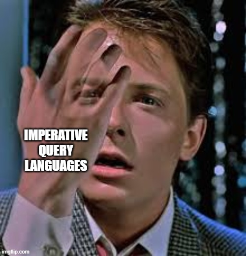

## Agenda - Full Hour Session

### Part 1: Presentation
1. Introduction: Why Data Models Matter
2. Relational Model vs Document Model
3. Query Languages
4. Graph-Like Data Models

### Part 2: Discussion
5. Structured Q&A and Group Reflection

---

## Why Data Models Matter

<div style="margin-top: 20px">

> "Data models are perhaps the most important part of developing software, because they have such a profound effect on what the software above them can and can't do."
>
> — Martin Kleppmann

</div>

<!--
"Kleppmann opens with this idea: data models are perhaps THE most important part of software development."

"Why? Because they fundamentally constrain what you can do.
Get it right, and complex problems might feel simple. Get it wrong, and simple problems become nightmares."
-->

---

# Part 1: Relational Model vs Document Model


<!--
"We will put this two different models in comparison"
-->

---

## The Evolution: Relational to NoSQL

**1970: Edgar Codd's Relational Model**
- Tables & SQL - dominated for 40+ years
- Replaced hierarchical (IMS) & network (CODASYL) models

**2010: NoSQL Movement**
- **Drivers**: Scale (billions of users), flexibility, specialized queries
- **Pioneers**: Google BigTable, Amazon Dynamo, Facebook Cassandra, LinkedIn Voldemort

<!--
The Relational Model was invented in 1970. Its main strength was hiding implementation details — you specify what you want, not how to navigate pointers.

Then, around 2010, tech giants started hitting the limits of relational databases.
Google was indexing billions of pages, Amazon needed shopping carts that were always available, and Facebook was dealing with billions of users.
So they built their own solutions: Bigtable, Dynamo, Cassandra.

This led to NoSQL — meaning “Not Only SQL.”
-->

---

## Object-Relational Mismatch

**The Impedance Mismatch Problem**

```
Application Code (OOP)          Relational Database
┌─────────────────┐            ┌──────────────────┐
│   User Object   │            │   users table    │
│  ┌──────────┐   │            │  ┌────────────┐  │
│  │ name     │   │  ◄────►    │  │ user_id    │  │
│  │ email    │   │            │  │ name       │  │
│  │ positions│   │            │  │ email      │  │
│  └──────────┘   │            │  └────────────┘  │
└─────────────────┘            └──────────────────┘
                               ┌──────────────────┐
                               │ positions table  │
                               │  ┌────────────┐  │
                               │  │ user_id    │  │
                               │  │ job_title  │  │
                               │  │ org        │  │
                               │  └────────────┘  │
                               └──────────────────┘
```

<!--
The book then talks about the idea of “impedance mismatch.”

In our code, we have User objects with a list of positions — nice and simple.
But relational databases can’t store lists in a single cell, so we need separate tables linked by foreign keys.

The problem is that loading a user profile becomes messy:
- In code, it’s just user.positions ✅
- In the database, you have to join two tables and rebuild the object from flat rows ❌
-->

---

## Solutions to Impedance Mismatch

<div class="grid grid-cols-2 gap-4">

<div v-click>

**Solution 1: ORMs (Object-Relational Mapping)**

- Automate the mapping between objects and tables
- Trade-offs: inefficient SQL, N+1 queries, over-fetching

Solves the problem but you trade control for convenience.

</div>

<div v-click>

**Solution 2: Document DBs**

```json
{
  "user_id": 123,
  "positions": [
    {"job_title": "Engineer"}
  ],
  "education": [
    {"school": "Cambridge"}
  ]
}
```

- Better locality (no JOINs)
- Matches code structure

</div>

</div>

<style>
pre[class*='language-'],
code[class*='language-'],
div[class*='language-'] {
    display: block !important;
    line-height: 1.4 !important;
    font-size: 0.9em !important;
}
</style>

<!--
So how do we solve the impedance mismatch? The book mention a couple of approaches:

**Solution 1 using ORMs**:
"ORMs automate the mapping. You write `user.positions` and the ORM handles the JOINs and reconstruction. But there are trade-offs like:
- Can generate inefficient SQL
- N+1 query problem (loading a list triggers many queries)
- Over-fetching (loading more data than needed)

In the end ORMs DO solve the repetitive mapping problem, but you trade control for convenience.

**Solution 2 using Document Databases** store the object as-is. This JSON maps directly to your code therefore no impedance mismatch.

**Document databases also comes with other advantages**:
1. **Locality**: No JOINs needed to get full user information.

**The Catch**:
This works great when you need the ENTIRE document. But if you only need the email field, you're still loading everything - positions, education, all of it. That wastes memory and bandwidth."
-->

---

## Key Trade-offs: Document vs Relational

| Aspect | Document | Relational |
|--------|----------|------------|
| **Schema** | Schema-on-read (flexible) | Schema-on-write (guarantees) |
| **Joins** | Weak support | First-class, optimized |
| **Locality** | Excellent (if need all) | Selective (if need parts) |
| **Relationships** | One-to-many ✅ Many-to-many ❌ | All relationships ✅ |

<!--
"Let's compare the fundamental trade-offs between document and relational databases:"

**Schema**:
"Document databases use schema-on-read - like dynamic typing. You can write any structure, and your code handles different versions. Flexible but requires careful application logic.

Relational uses schema-on-write - like static typing. The database enforces structure at write time. Less flexible but gives you guarantees and catches errors early."

**Joins**:
"Document databases have weak support for joins. You either denormalize data (duplicate it) or do joins in application code, which is slow.

Relational databases were built for joins. They're first-class operations, heavily optimized with indexes. This is their strength."

**Locality**:
"Document databases have excellent locality IF you need the whole document. Everything is stored together - one query gets you the complete user profile.

Relational is selective. If you only need the email field, you query just that. No wasted bandwidth. But if you need data from multiple tables, you pay the cost of joins."

**Relationships**:
"Document databases excel at one-to-many relationships - a user with many positions, a blog post with many comments. Tree-shaped data. But many-to-many? That's problematic.

Relational handles all relationship types naturally. One-to-many, many-to-many with junction tables - it's what they're designed for."
-->

---

## Schema Flexibility & Evolution

<div v-click>
<p>
**Schema-on-read** (Document):
```javascript
// No migration needed
if (user.full_name) {
  return user.full_name;
} else {
  return user.first_name + " " + user.last_name;
}
```
</p>
</div>

<div v-click>
<p>
**Schema-on-write** (Relational):
```sql
-- Migration required
ALTER TABLE users ADD COLUMN full_name TEXT;
UPDATE users SET full_name = first_name || ' ' || last_name;
ALTER TABLE users DROP COLUMN first_name, DROP COLUMN last_name;
```
</p>
</div>

<div v-click>
<p>
**Reality**: Schema-on-read ≠ schemaless! Still need versioning in code
</p>
</div>

<!--
It is worth spend a few words regarding schema flexibility, it is for sure powerful, but it's not without trade-offs.

Talking about **Schema-on-read**:
"Imagine you need to change first_name/last_name to single full_name field? you can just write new format. Code handles both versions. No migration, no downtime! Great for rapid iteration.

with **Schema-on-write on the other hand**:
you need to ALTER TABLE, UPDATE maybe millions of rows, might take some time, lock the table. It can be painful on big tables


So **The Catch** is schema-on-read doesn't mean 'no schema', it means 'schema in application code' and comes with some downsides:
- Code complexity (if/else everywhere)
- Bugs (forgot old format? Runtime error!)
You're responsible for correctness.

Instead with schema-on-write gives guarantees the database enforces correctness.
-->

---

## Polyglot Persistence & Convergence

<div v-click>

**Today:** Polyglot persistence - use different databases for different jobs
- PostgreSQL for transactions
- MongoDB for documents
- Redis for caching
</div>

<div v-click>

**But also**: Databases are becoming hybrid
</div>

<div v-click>

**Relational databases adding document features:**
- PostgreSQL, MySQL supports JSON columns

**Document databases adding relational features:**
- MongoDB: Multi-document transactions (4.0+)
</div>

<!--
"Today, many applications use what is called polyglot persistence - using different databases for different jobs. PostgreSQL for transactions, MongoDB for documents, Redis for caching. Each tool excels at specific things."

"But there's another trend happening at the same time - databases are converging!"

**Relational databases moving closer to Document databases**:
"PostgreSQL JSONB (since 2014): Store JSON alongside structured data. Index into JSON fields, query with operators. ACID + flexibility!"

**Document databases moving closer to relational databases**:
"MongoDB 4.0 (2018): Multi-document transactions! Also added $lookup for joins. Admitting relational features matter."

**The Future**:
"So we have both trends: using multiple specialized databases AND each database becoming more versatile. Where does this lead? Maybe we'll choose databases less by data model and more by operational needs - availability, consistency, performance characteristics."
-->

---

# Part 2: Query Languages



<!--
"Now let's talk about HOW we get data out of these systems. This is just as important as how we store it."
-->

---

## Imperative vs Declarative

<div v-click>

**Imperative** (How): Loop, check, push → 6 lines
```javascript
var sharks = [];
for (var i = 0; i < animals.length; i++) {
  if (animals[i].family === "Sharks") {
    sharks.push(animals[i]);
  }
}
```
</div>

<div v-click>

**Declarative** (What): Just say what you want → 1 line
```sql
SELECT * FROM animals WHERE family = 'Sharks';
```

</div>

<div v-click>

**Why declarative wins**: Concise, hides implementation, future-proof (add index → automatically faster!)

**Examples**: SQL (databases), CSS (browsers), XPath (XML), GraphQL (APIs)
</div>

<!--
Imperative (JavaScript): Tell computer HOW - loop through, check each, push to array. 6 lines.
Declarative (SQL): Tell computer WHAT you want - 'give me sharks'. 1 line. System figures out HOW."

**Why declarative wins** some reasons:
1. Concise (less code, fewer bugs)
2. Hides implementation logic
3. Future-proof (add index tomorrow? Query automatically 100x faster, no code change!)

**Universal examples**: "SQL for databases, CSS for browsers, XPath for XML, GraphQL for APIs. Same principle everywhere."
-->
