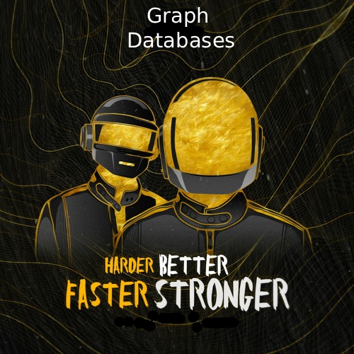

# Part 3: Graph-Like Data Models

---

<p></p>

Graphs are composed by 2 entities:
- <b>Nodes</b> (or vertices)
- <b>Edges</b> (or relationships)

Nodes represent entities, while edges represent relationships between those entities.

They are very useful to model complex relationships and interconnected data.
<b>If you have a lot of many-to-many relationships</b>, graphs can be a natural fit.

---

Some common examples:

- social graphs (people and their connections).
<br>Nodes are people, edges indicated which people know each other.
- Web graphs (web pages and hyperlinks).
<br>Nodes are web pages, edges are hyperlinks between them.
- Road or rail networks.
<br>Nodes are intersections or stations (junctions), edges are roads or tracks connecting them.

---

## Not only for that

But they are great also to represent a lot of heterogeneous data (Facebook uses this way).
<br>Example from book:

<div style="place-items: center; margin-top: 3em;">
    
</div>

<!--
If a country have a different subdivision system (e.g. states, provinces, regions, ...), you can just add the relevant nodes and edges without changing any schema.
-->

---

## Good properties

It's easy to navigate between related entities by following edges.

For example:

- find shortest path between two nodes
- find website with most incoming links
- find people within 3 degrees of separation

---

# Property Graphs

Special graphs, where:

Each Node consists of:
- A unique identifier
- A set of outgoing edges
- A set of incoming edges
- a set of properties (key-value pairs)

Each Edge consists of:
- A unique identifier
- A source node (tail node) - where the edge starts
- A target node (head node) - where the edge ends
- A label that describe the kind of relationship between the two nodes
- A set of properties (key-value pairs)

---

Important aspects:
- Any node can have any number of outgoing and incoming edges (no schema restrictions)
- Given a node, you can efficiently find its incoming and outgoing edges, so you can easily traverse the graph
- By using different labels for edges, you can represent different kinds of relationships, so you can store several types of data in the same graph, still maintaining a clean data model.

This means we could very easily add information to our previous example, like adding food allergen (introducing a node for each allergen, and an edge between a person and an allergen to indicate an allergy).

Then you could easily do a query to "find what is safe for each person to eat".

---

One can argue that you can achieve the same with a relational DB, like:

```sql
CREATE TABLE vertices (
    vertex_id INT PRIMARY KEY,
    properties JSONB
);

CREATE TABLE edges (
    edge_id INT PRIMARY KEY,
    tail_vertex INT REFERENCES vertices(vertex_id),
    head_vertex INT REFERENCES vertices(vertex_id),
    label VARCHAR,
    properties JSONB
);

CREATE INDEX edges_tails ON edges(tail_vertex);
CREATE INDEX edges_heads ON edges(head_vertex);
```

<!--
And it's true, but we'll see a possible disadvantage of using relational model for graph-like data in the next section.
-->

---

## Cypher Query Language

Most important thing: named after cypher character from "The Matrix".

Made for the Neo4j graph database (the one I heard about the most).

```cypher {1|2-5|6-7}{at:1}
CREATE
    (NAmerica:Location {name: 'North America', type: 'continent'}),
    (USA:Location {name: 'United States', type: 'country'}),
    (Idaho:Location {name: 'Idaho', type: 'state'}),
    (Lucy:Person {name: 'Lucy'}),
    (Idaho) -[:WITHIN]-> (USA) -[:WITHIN]-> (NAmerica),
    (Lucy) -[:LIVES_IN]-> (Idaho);
```

<!--
Above an example of creating nodes and edges with properties in Cypher, following the previous example.

Very readable syntax, where nodes are represented by parentheses () and edges by square brackets [].
-->

---

## Querying with Cypher

### Return every person name that was born in USA but now lives in EUROPE

<br>

```cypher
MATCH
    (person) -[:BORN_IN]-> () -[:WITHIN*0..]-> (us:Location {name:'United States'}),
    (person) -[:LIVES_IN]-> () -[:WITHIN*0..]-> (eu:Location {name:'Europe'}),
RETURN person.name
```

<br>

<v-clicks>

- Readable, very human-like syntax.
- Query optimizer can choose how to solve it

</v-clicks>

<!--
Query optimizer:
- start scanning all the people in the db, examine each person birthplace and residence and return only those who meets the criteria
- start from locations vertices and work backward, so first find all vertices representing USA and Europe then traverse back the edges following the WITHIN connections and finally look for people who can be found through incoming BORN_IN and LIVES_IN edges.
-->

---

Same query expressed in SQL:

```sql
WITH RECURSIVE
  -- in_usa is the set of vertex IDs of all locations within the United States
  in_usa(vertex_id) AS (
      SELECT vertex_id FROM vertices WHERE properties->>'name' = 'United States'
      UNION
	  -- recursive step: traverse `WITHIN` relationships backwards
      SELECT edges.tail_vertex FROM edges
        JOIN in_usa ON edges.head_vertex = in_usa.vertex_id
        WHERE edges.label = 'within'
  ),
  -- in_europe is the set of vertex IDs of all locations within Europe
  in_europe(vertex_id) AS (
      SELECT vertex_id FROM vertices WHERE properties->>'name' = 'Europe'
	  UNION
	  -- recursive step: traverse `WITHIN` relationships backwards
      SELECT edges.tail_vertex FROM edges
        JOIN in_europe ON edges.head_vertex = in_europe.vertex_id
        WHERE edges.label = 'within'
  ),
  -- born_in_usa is the set of vertex IDs of all people born in the US
  born_in_usa(vertex_id) AS (
    SELECT edges.tail_vertex FROM edges
      JOIN in_usa ON edges.head_vertex = in_usa.vertex_id
      WHERE edges.label = 'born_in'
  ),
```

---

```sql
  -- lives_in_europe is the set of vertex IDs of all people living in Europe
  lives_in_europe(vertex_id) AS (
    SELECT edges.tail_vertex FROM edges
      JOIN in_europe ON edges.head_vertex = in_europe.vertex_id
      WHERE edges.label = 'lives_in'
  )

SELECT vertices.properties->>'name'
FROM vertices
-- join to find those people who were both born in the US *and* live in Europe
JOIN born_in_usa     ON vertices.vertex_id = born_in_usa.vertex_id
JOIN lives_in_europe ON vertices.vertex_id = lives_in_europe.vertex_id;
```

<br>

<div v-click>
Different data models are designed to satisfy different use cases. <br>
It’s important to choose the right one for your application.
</div>


<!--
I'd argue that this looks way more complex and harder to read than the 4-lines Cypher version.

We're also using Recursive Common Table Expression to traverse the graph, non super common and easy to grasp.
-->

---

# Triple stores

- Mostly equivalent to property graphs, uses different words to describe the same concepts.
- All information is represented as triples: (subject, predicate, object)

<br>

<v-clicks>

```
(Stefàno, likes, pineapple-on-pizza)
```

Stefàno is the subject, likes is the predicate, pineapple-on-pizza is the object.

</v-clicks>

---

With triples you can represent nodes and edges as:

- Nodes: (Stefàno, type, Person)
- Edges: (Stefàno, likes, pineapple-on-pizza)

So you represent everything as triples.

With Turtle syntax, the previous example becomes:

```
@prefix : <urn:example:>.
_:stefano a :Person;
_:stefano :name "Stefàno";
_:stefano :likes _:pineapple-on-pizza.
```

Or, short version

```
@prefix : <urn:example:>.
_:stefano a :Person; :name "Stefàno"; :likes _:pineapple-on-pizza.
```

---

## Semantic web

The semantic web is an extension of the current web in which information is given well-defined meaning, better enabling computers and people to work in cooperation.

RDF (Resource Description Framework) is a standard model for data interchange on the web, based on triples.

The idea was to create a universal data model that could be used to represent information about resources on the web, allowing data from different sources to be linked and integrated, creating a kind of internet-wide "database of everything".

It never took off (was over-hyped in the early 2000s).

Triple stores are often "bound" to the semantic web because of it, but it's independent from it and it can be used to store graph-structured data.

---

## SPARQL Query Language

SPARQL (pronounced "sparkle") is a query language for triple-stores using the RDF data model.

It's similar to Cypher

Previous Cypher example, rewritten in SPARQL:

```sparql
PREFIX : <urn:example:>

SELECT ?personName WHERE {
    ?person :name ?personName .
    ?person :bornIn / :within* / :name "United States" .
    ?person :livesIn / :within* / :name "Europe" .
}
```

<br>

Mentioned in the book because even if usually only mentioned with semantic web, SPARQL is actually a very powerful language that can be used with any triple store.

---

## Are graph databases similar to old network model (CODASYL)?

Not really, because:

<v-clicks>

- CODASYL model is schema-based, while graph databases are schema-less (any node can be connected to any other node)
- In CODASYL the only way to navigate the data is through predefined paths, while in graph databases you can traverse the graph in any direction, following any edge.
- In CODASYL children of a record were an ordered set (meaning that DB had to maintain ordering, consequences for storage layout), while in graph databases edges are unordered (you can only sort them at query time).
- In CODASYL queries were imperative, difficult to write and easily broken by changes in the schema

</v-clicks>

---

<div style="place-items: center; margin-top: 3em;">
    
</div>

<!--
Graphs are a lot more flexible, easier to navigate,
-->

---

## Their foundation: Datalog

<br>

- much older than SPARQL or Cypher. (studied in 1980s)
- Provided fundamentals that later query languages build upon.
- Casalog is a Datalog implementation for querying large datasets in Hadoop.
- Similar to triple-store model.
- Format predicate(subject, object)

<br><hr><br>

```
name(namerica, 'North America').
type(namerica, continent).

name(usa, 'United States').
type(usa, country).
within(usa, namerica).

name(idaho, 'Idaho').
type(idaho, state).
within(idaho, usa).

name(lucy, 'Lucy').
born_in(lucy, idaho).
```

<!--
This is how you define the data
-->

---

Querying

- We define rules/predicates (kind of like functions)
- A rule applies if the system can find a match for all predicates on the righthand side of the `:-` operator. When the rule applies, it’s as though the lefthand side of the `:-` was added to the database (with variables replaced by the values they matched).
- These rules can be re-used which might cope better if the data is complex.

```
within_recursive(Location, Name) :- name(Location, Name).     /* Rule 1 */

within_recursive(Location, Name) :- within(Location, Via),    /* Rule 2 */
                                    within_recursive(Via, Name).

migrated(Name, BornIn, LivingIn) :- name(Person, Name),       /* Rule 3 */
                                    born_in(Person, BornLoc),
                                    within_recursive(BornLoc, BornIn),
                                    lives_in(Person, LivingLoc),
                                    within_recursive(LivingLoc, LivingIn).

?- migrated(Who, 'United States', 'Europe').
```

<!--
This is how you query

I think you can feel that it's older and less expressive than Cypher or SPARQL

Personally I didn't like it much, but the book says it requires a different kind of thinking compared to other query languages, so that might be the reason.

It's also written that it's very powerful because rules can be combined and reused to express complex queries in a more manageable way.
-->

---

# Summary

<v-clicks>

- Data models is a huge topic, we just scratched the surface. It's important to know what options are available and to think about the data model when designing a system, based on your requirements.
- We started representing data as on big tree (hierarchical model).
- Wasn't good for many-to-many relationships, so Relational model was created.
- Recently we found that some applications don't fit well with relational model, so NoSQL databases were created, with different data models (key-value, document, column-family, graph).
  - Document DB target use-cases where data comes in self-contained documents and relationships are rare.
  - Graph DB goes into opposite direction, targeting highly interconnected data with many-to-many relationships (everything potentially connected to everything else).
- All three models are still widely used today, each one targeting different use-cases.
- You can usually emulate a model using another one, but it's usually not optimal.
- Even when a schema is not strictly required (NoSQL DBs), it's actually implicit (`assumed on read` instead of `enforced on write`).

</v-clicks>

<!--
There are a lot of other data models we didn't mention (e.g. genome data for similarity searches, full-text search engines, ...).
-->

---

# Reflection time

<div style="place-items: center; margin-top: 2em;">


> SQL or NoSQL, that is the question.

</div>

---

# Reflection time

- SQL vs NoSQL is always a hot topic. In ILPT I've the feeling we just opt-in for SQL by default, thoughts?
- GraphDB, anyone ever used one? Opinions?
- ORM: opinions? Do you prefer writing raw queries, or using an abstraction layer?
- What's your experience in choosing data models for your applications? Do you think you ponderated enough on it, or do you feel it's often an afterthought?
- Schema migration - how do you handle it in your projects?
- A bit off-topic: opinions / experiences with other managed DBs, for example DynamoDB, CosmosDB?
