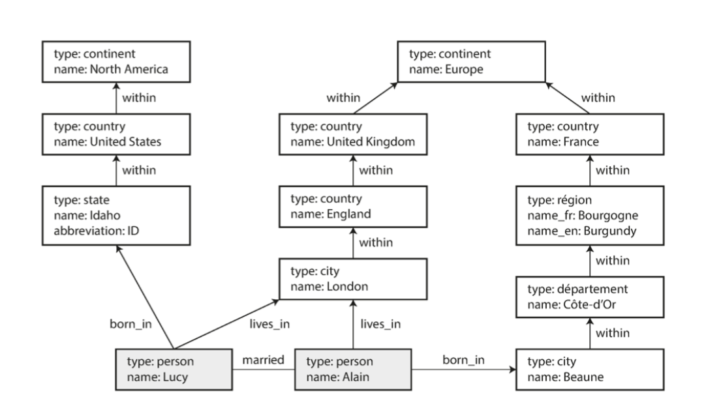

# Graph-Like Data Models

<p></p>

Graphs are composed by 2 entities:
- <b>Nodes</b> (or vertices)
- <b>Edges</b> (or relationships)

Nodes represent entities, while edges represent relationships between those entities.

They are very useful to model complex relationships and interconnected data.
<b>If you have a lot of many-to-many relationships</b>, graphs can be a natural fit.

---

Some common examples:

- social graphs (people and their connections).
<br>Nodes are people, edges indicated which people know each other.
- Web graphs (web pages and hyperlinks).
<br>Nodes are web pages, edges are hyperlinks between them.
- Road or rail networks.
<br>Nodes are intersections or stations (junctions), edges are roads or tracks connecting them.

---

## Not only for that

But they are great also to represent a lot of heterogeneous data (Facebook uses this way).
<br>Example from book:

<div style="place-items: center; margin-top: 3em;">
    
</div>

---

## Good properties

It's easy to navigate between related entities by following edges.

For example:

- find shortest path between two nodes
- find website with most incoming links
- find people within 3 degrees of separation

---

# Property Graphs

Special graphs, where:

Each Node consists of:
- A unique identifier
- A set of outgoing edges
- A set of incoming edges
- a set of properties (key-value pairs)

Each Edge consists of:
- A unique identifier
- A source node (tail node) - where the edge starts
- A target node (head node) - where the edge ends
- A label that describe the kind of relationship between the two nodes
- A set of properties (key-value pairs)

---

Important aspects:
- Any node can have any number of outgoing and incoming edges (no schema restrictions)
- Given a node, you can efficiently find its incoming and outgoing edges, so you can easily traverse the graph
- By using different labels for edges, you can represent different kinds of relationships, so you can store several types of data in the same graph, still maintaining a clean data model.

This means we could very easily add information to our previous example, like adding food allergen (introducing a node for each allergen, and an edge between a person and an allergen to indicate an allergy).

Then you could easily do a query to "find what is safe for each person to eat".

---

One can argue that you can achieve the same with a relational DB, like:

```sql
CREATE TABLE vertices (
    vertex_id INT PRIMARY KEY,
    properties JSONB
);

CREATE TABLE edges (
    edge_id INT PRIMARY KEY,
    tail_vertex INT REFERENCES vertices(vertex_id),
    head_vertex INT REFERENCES vertices(vertex_id),
    label VARCHAR,
    properties JSONB
);

CREATE INDEX edges_tails ON edges(tail_vertex);
CREATE INDEX edges_heads ON edges(head_vertex);
```

---

## Cypher Query Language

