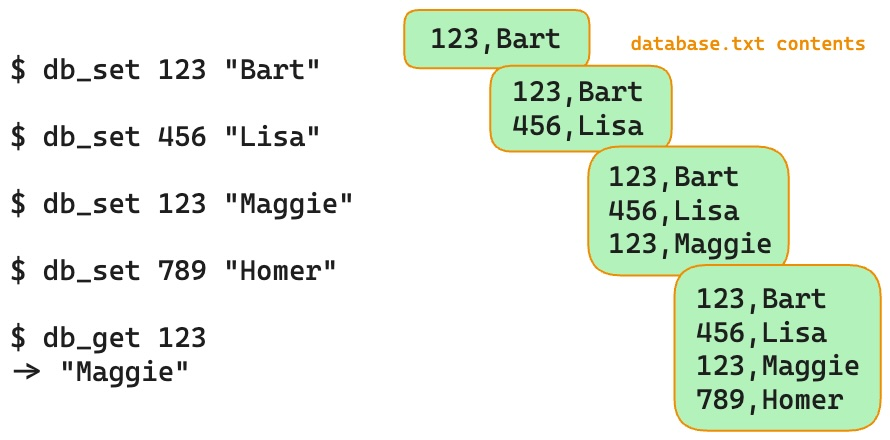
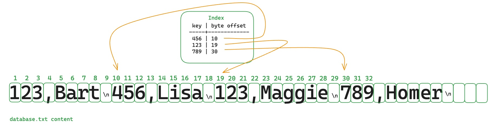
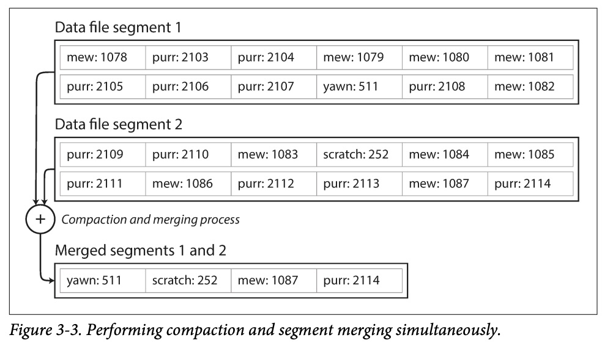
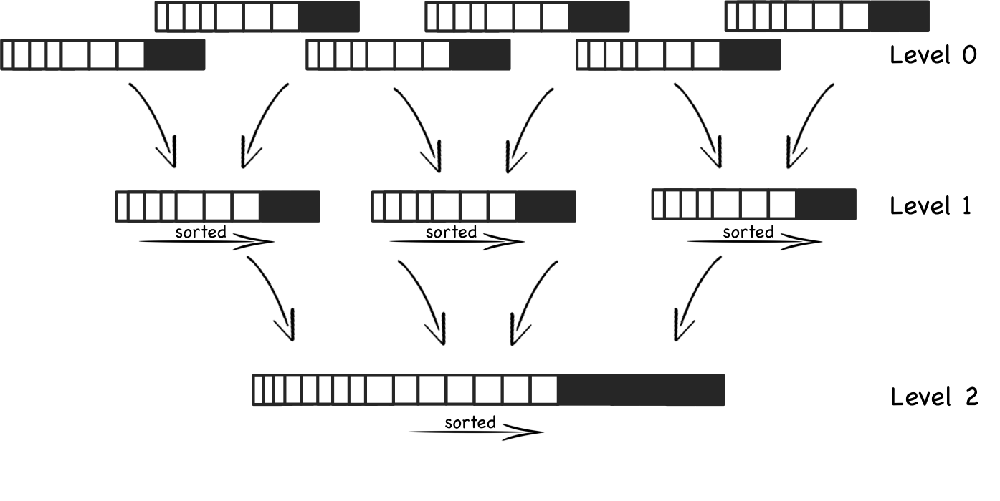
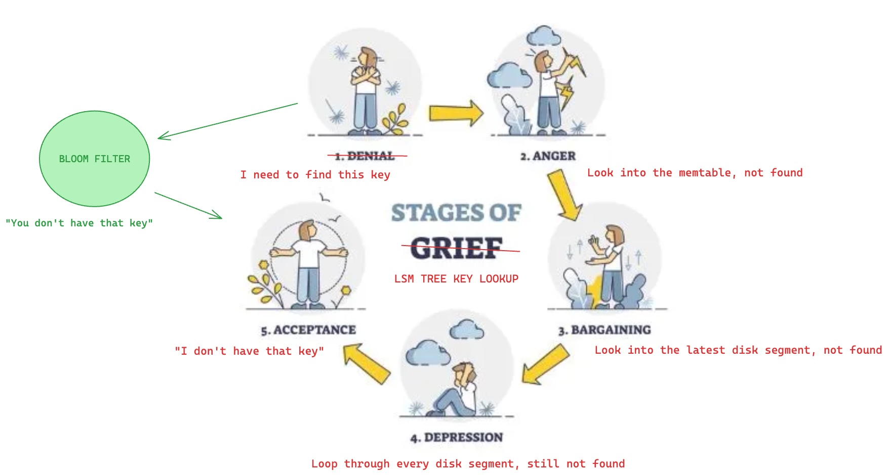
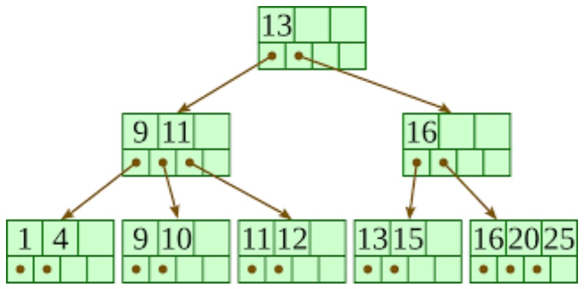
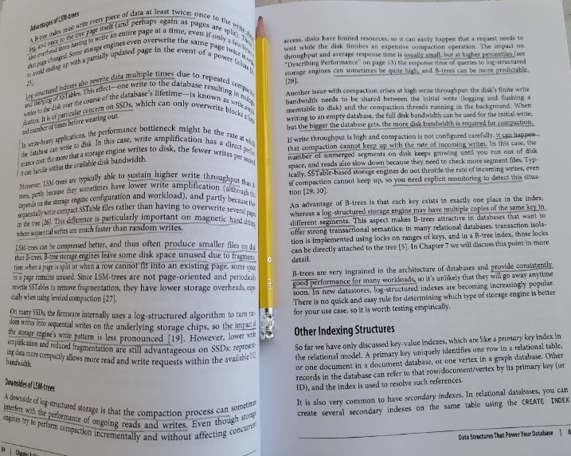

# Storage and Retrieval

On the most basic level a database does only two things:
- stores some data
- when asked, gives that data back

---

# Who cares about database engines?

<br>
- Why should I care about databases and how they are made?

Because as developer you should know which database is more fit to your application requirements.

Every engine has his own strenghts and weaknesses, so it's important to make the right choice.

> For example some engines are optimized for analytics, some for transactional workloads, so you need to have a rough idea of what your database is doing under the hood.

---

# Let's start from scratch

Let's build our first database

```bash
#!/bin/bash

db_set () {
		echo "$1,$2" >> database
}

db_get () {
	grep "^$1," database | sed -e "s/^$1,//" | tail -n 1
}
```

It may look trivial, but it works!

(if you want to get serious [take a look at this](https://www.nan.fyi/database))

---

# Our database in action




---

# It's great because

- it's simple 

- good WRITE performances (append to file is fast)


# It's also terrible because

- bad READ performance 

- ...and it gets worse the more data is stored [O(n)]

- space used only keeps growing

- no concurrency control

- no error handling/partially written records/...

---

# How can we achieve faster reads?
<br/>
<br/>

<br/>

## Why the read operation is slow?

Because in order to find the key we're looking for, we need to scroll through the whole data.

## What can we do to fix that?

Keep some additional metadata on the side which acts as signpost to quickly locate the data we want

---

# Hash Index

An index is a derived data structure with some metadata that helps navigate through the database contents.

<br/>

<br/>

We're adding a simple in-memory hashmap
mapping each key to his specific byte position inside the file.

So when we need to access to the value of a key:

- instead of looping through each character of the store
- we can jump straight to the correct index, because the index tell us where it is.

---

# Hash Index

- An index greatly improves the read performances
- The cost is moved to the write operation, any time some data is written, you must update the index as well.

> This tradeoff is the reason it is not enabled by default everywhere. The developer must decide when and where is appropriate to enable it.

- Indexes can be added or removed without affecting the main data.

- If you need to search through data on multiple different keys, then you might need multiple indexes

- This approach shines when you have a large amount of writes per key

> (AND you have enough available memory to store all the keys)


This might look simplistic, but it's a real viable approach (see Bitcask - the default storage engine in Riak)

---

# How can we stop wasting disk space

On the first implementation of our db:
- when we udpate a record, we add a new line on the same key
- when we delete a record, we add a new line with a tombstone special character

With this append-only storage even delete operations add new data to the disk

It works but our disk space used only keeps growing with time; with a big enough dataset this is not sustainable.

---

# Compaction procedure

We cycle through the whole storage file and remove "useless" rows (the one that get overwritten by new values on the same key).

<br/>

<br/>

To apply this to our store we need to:

- break the log into segments of a certain size
- when we reach the size limit we move into a new block
- then we apply compaction between the blocks (can be done in the background)
- we now merge the output into new segment files
- we can now delete the old segments (and free some disk space)

---

# Compaction procedure

- Each segment must own his dedicated index table
- Indexes must be re-calculated based on the new compacted file version

<br/>

<br/>

## Question time:

why should I split my store in segments and not just keep it unified instead?

---

# Other boring details in real-life scenarios

FILE FORMAT:

> CSV is not be the best format for a log.

> It's faster and simpler to use a binary format that defines a string length before the actual string (in order to avoid escaping)


CRASH RECOVERY:

> On restart you should re-calculate all the hashes, but this can be long and painful on large dataset.

> A simple copy of the current index map on disk can speed things up for good.


PARTIALLY WRITTEN RECORDS:

> If a crash happens during a write, we need a way to detect broken logs and ignore them.


CONCURRENCY CONTROL:

> Write are simple append in a strict sequential order, --> requires a single dedicated thread.

> Read can run in parallel threads

---

# Append-only storage notes:

Append-only store might seem wasteful at first glance but are actually pretty good for various reasons:

- Append and merge are sequential write operations
so they are very fast on magnetic, disk spinning and sometimes even on SSD hard drives

- Concurrency and crash recovery are easy to manage with this write model

- Segment merging automatically solves the problem of data fragmentation on disk

But they are also unfit on some scenarios:

- *The hash table must fit in your memory*, so a large amount of keys might be a problemino
(you should move the hashmap to disk which is slow and painful, has terrible random access performances, no hash key collision mechanism, yadda yadda, ...)

- *Range queries are not efficient*
so if you need to fetch all HELLO_KITTY keys from HELLO_KITTY_0001 to HELLO_KITTY_9999
each key must be obtained from the hashmap
and your HELLO_KITTY consumption is slowed down by a good margin

---

# SSTables and LSM-Trees

AKA Sorted String Table and Log-Structured Merge-Tree

starting from the previous implementation we will just sort the rows by key.

<br/>

<br/>

---

# Advantages

1. We no longer need an index of all keys in memory.
> We still need an index file, but it include only some of the keys, not all.
Just jump to the closest index and start searching from there.

<br/>

2. Merging segments together is simple and efficient
> even if the files are bigger than available memory
(just read the two segments together and take the lowest value every time
if the same key appears twice, take it from the most recent segment)

<br/>

3. It is possible to group records into a block and compress them before writing them into disk.
> less disk space used also means less I/O bandwidth usage, too


NOTE: For various reasons it's much easier to maintain a SSTable on-memory (MEMTABLE) than doing so on disk.

---

# How to write and maintain SSTables

There's the specific algorithm already defined for this, so we can skip the details

https://en.wikipedia.org/wiki/Log-structured_merge-tree

ADD A NEW ENTRY: 
- add the new entry on memory (the memtable)
- when the memtable grows too big, write it down into the disk

READ AN ENTRY:
- look for the key on the memtable
- if not found, look on most recent disk segment
- if not found, then keep looking into older segments

FROM TIME TO TIME:
- run merge and compaction in the background, to cleanup wasted space.


---

# What if Murphy's law strikes?
...and it will...


If a crash happens, the memtable gets wiped off and we will lose all the most recent changes.

In order to avoid this, we can keep a separate on-disk log storage with the most recent changes appended.

This will allow us to re-construct the memtable if a crash happens.

Once memtable gets flushed to disk we can wipe this log storage as well.

---

# Performance optimization

This idea of LSM Trees works well even when the dataset is much bigger than available memory.

- Range queries are fast and efficient because data is stored in order

- Write throughput is high because because disk writes are sequential

- In order to decide how SSTables are compacted and merged there are different strategies
(size-tiered and compaction).

- one scenario where LSM-Tree algorithm suffers, is when the key does not exists.

That's because you have to look into the memtable, then on disk through the segments all the way until the oldest one,
then resign and accept the fact that the key you're looking for does not, in fact, exist.

---

# Solution
In order to mitigate this problem a Bloom filter can quickly tell you if a key appears or not into the store.

<br/>

<br/>


---

# B-Trees
yeah LSMTrees are cool and all, but the most widely used indexing structure are B-TREES.

They are considered the standard index implementation in almost all relational databases (and some non-relational, too)

Like LSMTrees they keep key-value pair sorted by key, but the philosophy is quite different otherwise.

The algo implementation is well documented

https://en.wikipedia.org/wiki/B-tree

<br/>

<br/>

---

# B-Trees


- BTREES break the database down into fixed-sized blocks (generally 4kB or sometimes bigger)

> this choice is taken in order to reflect the underlying hardware

- BTREES and read/write one page at time

- Each page can be identified using an address

> ... which allows one page to ref another, similar to C pointers, but on disk instead of memory.

- One page is the ROOT of the BTREE, every search for keys always starts from here.

- Each child is responsible for a continuous range of keys

- The keys between a reference indicate the boundaries

---

# Update a BTree:

- look for the previous key value
- update the value on that page
- write the page back into disk

<br>

# Add new data to a Btree:

- find the range where you new key must end
- add the key to that page
- if the page is full, split the page in two and create the links

A balanced BTREE with N keys always has a depth of O(log n)

> (a four level tree of 4kB pages with a branching factor of 500 can store up to 250TB)


---

# Reliability

<br>
The basic write operation on BTREE are overwrite operations on disk.

Also some operations require different pages to be overwritten together.

IF the database crashes during such events, only some pages end up being overwritten and you land in an corrupted index state.

## How to make the database resilient to crashes?

WAL (write-ahead-log) can restore our lost index table status if the power goes off.

## How to avoid multiple write thread to mess things up?

With a careful concurrency control, no shortcuts here.

---

# B-Trees vs LSM-Trees

<br/>

<br/>

TL:DR;
- LSM-Trees are faster for writes

- BTREES are faster for reads


---

# Other indexing structures

so far we discussed only key-value indexes, but it's also very common to have secondary indexes

> crucial to perform joins efficiently

A secondary index can be created by using a key-value index, but the main difference is that there might be many rows for the same key.
You can implement this by either

- by making each value in the index a list
- by making each entry unique by appending a row id to it.

either way BTREES and LSMTrees can be used as secondary indexes.

---

# Storing values within the index

the key in an index is the thing that queries search for, but the value can be two things:

- the actual row
- a reference to the row, which is stored elsewhere

> on the latter case elsewhere = heap file which stores data in no particular order.


This approach is common when multiple secondary keys are present as it does not duplicates the data

Updates are efficient until the new value is no larger than the previous value.
> if this is not the case things can get complicated (move stuff around, update indexes, all that sort of stuff...)

but in some cases the extra hop to the heap file can be too much, so it could be desirable to store the indexed row straight into an index

---

# Different strategies
<br>

Clustered index:
> storing all row data within the index

Nonclustered index:
>	store only reference to the data wihin the index

Index with included columns:
> hybrid approach, that stores only some of the table's columns within the index

---

# Multi-column indexes

The indexes before map only one key to one value.
But if we need to query multiple columns of a table, this is no longer enough.

Concatenated indexes is the most common type, it combines several fields in one key

```
SELECT * FROM restaurants WHERE lat > 51.234 AND  lat < 51.567
													AND  long > -0.112 AND long < -0.201
```

Examples:

	- phone book where first name + last name => phone number
	- geospatial data (longitude + latitude)
	- RGB (3d) for finding a products in a certain range of colors
	- weather (temperature + date)

<br>

> NOTE: A standard BTree or LSMTree are not fit to manage this kind of query efficiently.

---

# Fuzzy search

Until now we had exact data to search our keys, but this is not always the case.

In real life we have to deal with:

- similar keys
- typos
- synonyms of a word
- grammatical variations

Lucene is able to work with words with a distance of 1 letter (removed, added or replaced)

In order to do this Lucene has a SSTable-like structure for its dictionary.

Other fuzzy search techniques use document classification and ML.


---

# Keep everything in memory
Because disks are awkward to deal with.

to achieve good performance you have to know how they work, but they are cheap and durable, so we tolerate them.

But nowadays RAM is getting bigger and cheaper too, so we start to see in-memory databases.

- battery-powered RAM
- logs on disks
- periodic snapshots on disk
- replication on other machines

Advantages:

- NOT on performances! disk-based db are commonly cached on RAM already
the benefit is avoiding the encoding/data-structures required for writing into disks

- some data structure are difficult to implement on disk-based storages (ex. prio queues and sets)

---

# End of first part

<br/>

<br/>