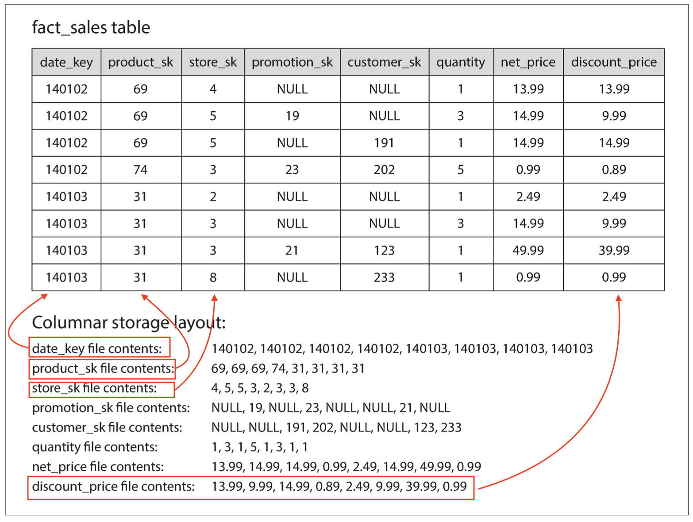

# Transaction Processing

transaction: a group of reads and writes that form a logic unit

Transaction processing: allowing clients to make low-latency reads and writes
Batch processing: periodically run to process a batch, chapter 10
OLTP
<!--
In early days of business a write to the database typically corresponded to a "commercial transaction": making a sales, placing an order
the term stuck referring to a group of reads and writes that form a logic unit
-->

---

# Analytics Processing

OLAP

---

# Comparing OLTP with OLAP

| Property | **Transaction processing systems (OLTP)** | **Analytic systems (OLAP)** |
|----------|---------------------------------------|-------------------------|
| **Main read pattern** | Small number of records per query, fetched by key | Aggregate over large number of records |
| **Main write pattern** | Random-access, low-latency writes from user input | Bulk import (ETL) or event stream |
| **Primarily used by** | End user/customer, via web application | Internal analyst, for decision support |
| **What data represents** | Latest state of data (current point in time) | History of events that happened over time |
| **Dataset size** | Gigabytes to terabytes | Terabytes to petabytes |

---

# Data warehouse

From 1990s companies started using a separate database to run analytics query

ETL: **Extract–Transform–Load**


---

# Divergences between OLTP databases and data warehouses

both have sql query interface
vendor focus on support one only type

Vendor that support both in the same product but behind the scene they use separate storage and query engines
* Microsoft SQL Server
* SAP HANA 

Teradata, Vertica SAP HANA and ParAccel: under expensive commercial licenses
Amazon RedShift is a hosted version of ParAccel
Apache Hive, Spark SQL, Cloudera Impala, Facebook Presto, Apache Tajo, and Apache Drill: OpenSource

Some of them are based on Google's Dremel Research

---

# Stars and Snowflakes

Data warehouse require to handle different data models
dimensional modeling

---

# ⭐ Star Schema


<!--
fact -> event
dimensional -> who, what, where, when, how and why

event date and time can using dimension table, this allow additional info like holidays

each row on fact table is an event that occurs on a particular time
-->

---

# ❄️ Snowflakes Schema

It's a variation of the Start

dimensions are broken into subdimensions


<!--
dim_product can have dim_brands and dim_category

typical data warehouse contains fact tables with easily over 100 columns

dimension tables can be very wide too
-->

---

# Column-Oriented Storage

imagine storing and querying trillions of rows

dimension table are usually much smaller, like millions

typical data warehouse contains fact tables with easily over 100 columns

but usually queries access 4 or 5 of them. SELECT * queries are rarely used

example

every occurrence of someone buying fruit or candy during the 2024 calendar year

how can we query efficiently?

OLTP dbs store table in a row-oriented fashion.
Every row are stored next to each other.
We have index that tell the storage engine where to find the data but this force the engine to load all the rows from disk to memory then parse theme and filter out. That take a long time.

column-oriented storage came in help

don’t store all the values from one row together, but store all the values from each column together instead.
If each column is stored in a separate file, a query only needs to read and parse those columns that are used in that query, which can save a lot of work

---

# Column-Oriented Storage




---

# Column Compression

Bitmap Encoding

<v-switch>
  <template #0></template>
  <template #1></template>  
</v-switch>

<!--
The bit is 1 if the row has that value, and 0 if not.

Often, the number of distinct values in a column is small compared to the number of
row

if n are small those bitmaps can be stored with one bit per row
if n is bigger there will be a lot of 0 (sparse). Those values can additionally be run-length encoded

WHERE product_sk IN (30, 68, 69):
  Load the three bitmaps for product_sk = 30, product_sk = 68, and product_sk
  = 69, and calculate the bitwise OR of the three bitmaps, which can be done very
  efficiently.


WHERE product_sk = 31 AND store_sk = 3:
  Load the bitmaps for product_sk = 31 and store_sk = 3, and calculate the bit‐
  wise AND. 


This works because the columns contain the rows in the same order,
  so the kth bit in one column’s bitmap corresponds to the same row as the kth bit
  in another column’s bitmap.

-->

---

# Column Compression


```sql
WHERE product_sk IN (30, 68, 69):
```
<v-click>
  Load the three bitmaps for product_sk = 30, product_sk = 68, and product_sk
  = 69, and calculate the <strong>bitwise OR</strong> of the three bitmaps, which can be done very
  efficiently.
</v-click>
```sql
WHERE product_sk = 31 AND store_sk = 3:
```
<v-click>
  Load the bitmaps for product_sk = 31 and store_sk = 3, and calculate the <strong>bitwise AND</strong>. 
</v-click>


<v-click>
<p>
This works because the columns contain the rows in the <strong>same order</strong>, so the kth bit in one column’s bitmap corresponds to the same row as the kth bit in another column’s bitmap.
  </p>
</v-click>

<!-- 
column data can be splitted into chucks that fit in CPU L1 cache where CPU can iterate in a tight loop (without function call).
This is much faster then running in code (because no function calls)
Column compression allows more rows of column to fit on L1 cache. Bitwise operations can be designed to operate a such level, this is call VECTORIZED PROCESSING
-->

---

# Sort Order in Column Storage

Administrator should choose based on knowledge by which column to sort
eg: 
* we need most of the time last month data it make sense to have data sorted by date
* we can use product as a second sort so rows with same product will be stored nearby and group or filter by product will be much faster than scanning all rows

Sort have benefits on column compression because the sequence of zero are long and run-length encoding will efficiently compress down to few kilobytes

This compression are strongest for the first sort key

Having the first few column sorted is still a win overall


---

# Writing to Column-Oriented Storage

Writing aren't efficiently because we have to keep in sync all dimension file and if we add a row in the middle we have update all table files

A solution here is to make the write happen in memory like in the LSM-trees
Once a bulk of writes have been accumutaled they are merged with column file on disk and written to a new files in bulk 

👆Vertica

---

# Materialized Views and Data Cubes

## Materialized Aggregates

### COUNT, SUM, AVG,MIN or MAX
why not cache some of the counts or sums that queries use most often?

materialized view is such a cache.
relationa data model -> **standard (virtual) view** -> results of some query

materialized view is instead an actual copy of the query results, written to disk.

---

## Real-World Examples

| System | Engine Type | Notes |
|--------|--------------|-------|
| PostgreSQL | B-Tree | WAL + pages |
| MongoDB | WiredTiger (LSM-like) | Compaction heavy |
| Cassandra | LSM | Optimized for writes |
| RocksDB | LSM | Used inside many apps |

> We use these patterns daily, even if we don’t notice.

---

## Reflection: What about us?

### Let’s look at our stack 👇

| Concept | DDIA Advice | Our Reality |
|----------|--------------|-------------|
| Storage engine | Choose based on workload | ? |
| Indexing | Keep hot paths indexed | ? |
| WAL / durability | Always write before commit | ? |
| Compaction / cleanup | Monitor I/O pressure | ? |


---

## Key Takeaways

- Every system balances **durability, speed, and simplicity**
- B-Trees and LSMs are not enemies — just **different survival strategies**
- WAL is your best friend during crashes
- Knowing storage internals helps build **better APIs and scalable services**


---

## Discussion Time 💬
**How data moves in *our* company**

Prompts:
- Which systems are more write-heavy vs read-heavy?
- Any painful experiences with compaction, caching, or indexing?
- Do we have visibility into our storage behavior?
- How could DDIA concepts improve performance or reliability?

---

## 🙌 Thank You
Let’s dive into discussion.  
**What does “storage and retrieval” mean for *our* daily work?**
