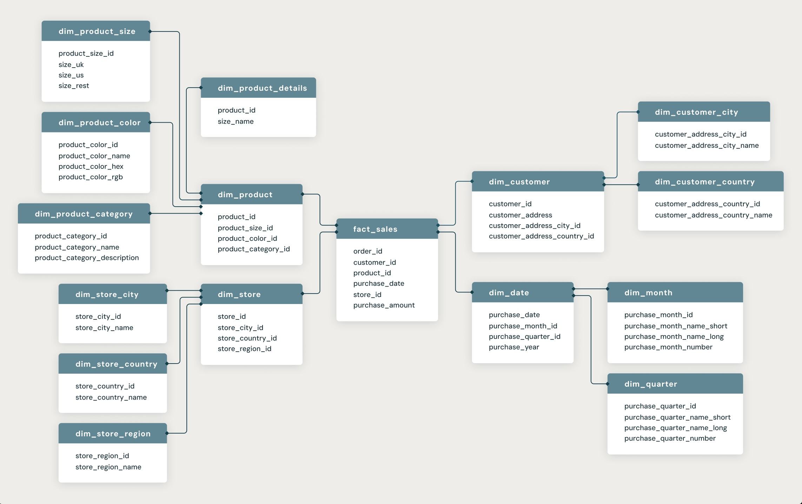
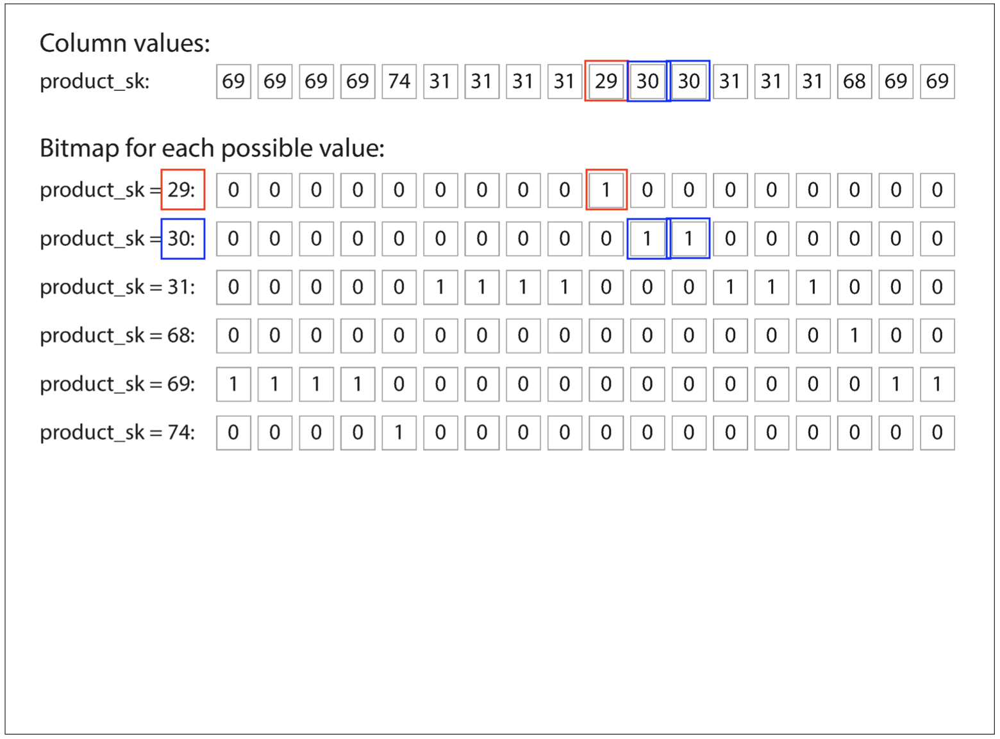
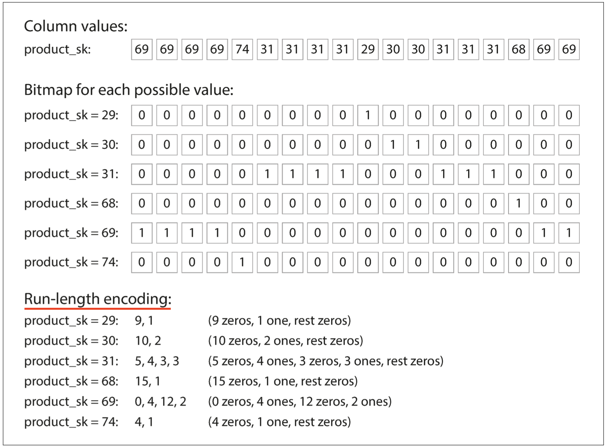
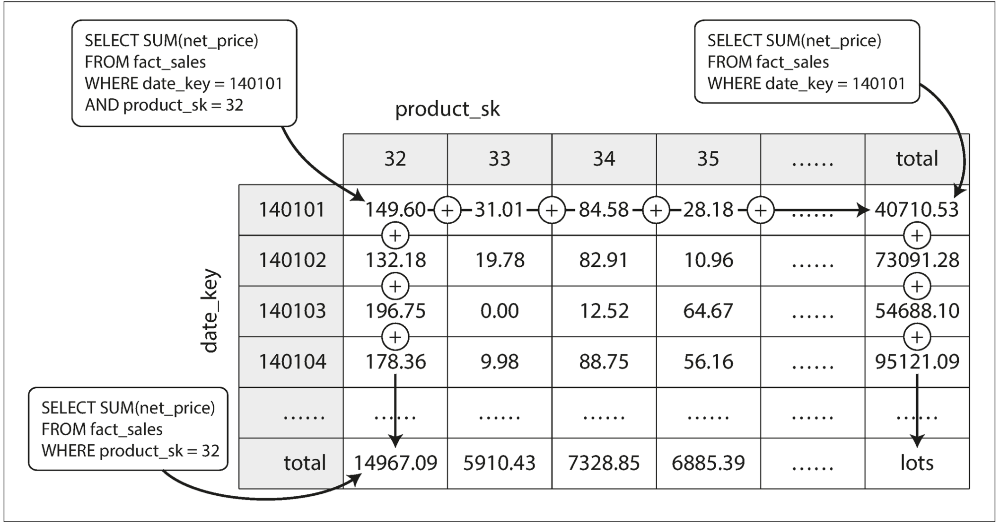
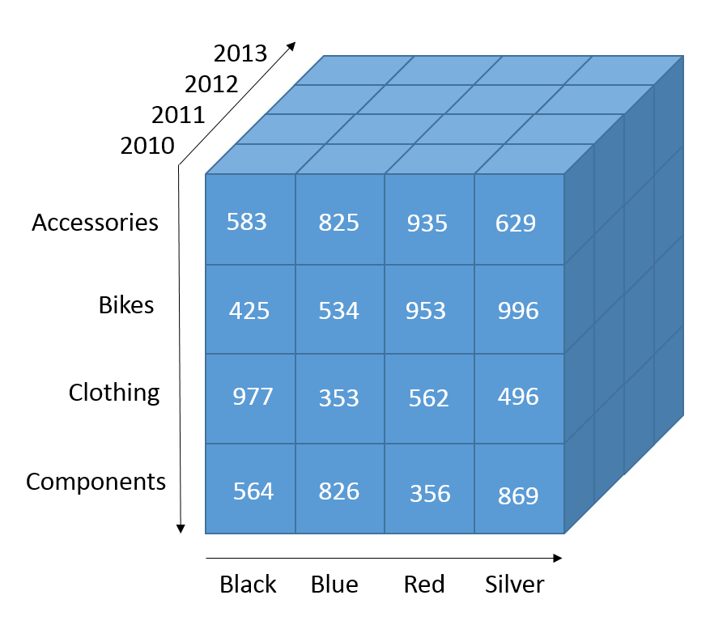

# Transaction Processing vs. Analytics

Two primary database use cases with very different requirements:

<v-click>

**Transaction Processing (OLTP)**
- Handle many concurrent, low-latency reads and writes
- Example: Customer purchasing on an e-commerce site
</v-click>

<v-click>

**Analytic Processing (OLAP)**
- Gain insights from large datasets
- Complex queries, aggregations, historical trends
- Example: "What were our top-selling products last quarter?"

</v-click>

<!--
The term "transaction" originally meant a literal commercial transaction - a sale, an order, a payment. Today, in database terms, a transaction is any group of reads and writes that form a single logical unit.

[click] OLTP - Online Transaction Processing - is what most of us think of as a "normal" database. When a user clicks "buy now," the system needs to check inventory, create an order record, update the cart, charge the credit card - all within milliseconds. Each operation touches a small number of records but happens thousands of times per second.

[click] OLAP - Online Analytic Processing - is a different beast entirely. Business analysts don't care about individual transactions. They want to answer questions like "Which product categories are growing?" or "What's our customer retention rate by region?" These queries might scan millions of records but run only a few times per day.

The fundamental insight: these two workloads are so different that trying to optimize one database for both is nearly impossible.
-->

---
clicks: 5
---

# Comparing OLTP with OLAP

<v-clicks>

| Property | **OLTP** | **OLAP** |
|----------|----------|----------|
| **Read pattern** | Small records by key | Aggregate over millions |
| **Write pattern** | Low-latency random writes | Bulk import (ETL) |
| **Users** | End customers | Internal analysts |
| **Data meaning** | Current state ("now") | Historical events ("timeline") |
| **Scale** | Gigabytes to terabytes | Terabytes to petabytes |

</v-clicks>

<!--
Let's unpack these fundamental differences row by row.

[click] Read patterns: OLTP asks "Show me user ID 12345's profile" - a targeted lookup. OLAP asks "What were total sales last quarter across all regions?" - scanning millions of records to compute an aggregate.

[click] Write patterns: OLTP handles real-time user actions - every purchase, every click, every update happens immediately. OLAP typically gets loaded once daily through an ETL process during off-peak hours. Real-time analytics exists but adds significant complexity.

[click] Users: OLTP is customer-facing - your production database powering the website or app. OLAP is for your business intelligence team, data scientists, and executives making strategic decisions.

[click] Data meaning: OLTP is a snapshot - "what is the current state?" It's constantly overwriting old data. OLAP is a movie - "what happened and when?" It accumulates history, rarely deleting anything.

[click] Scale: Because OLAP stores years of historical data and rarely deletes, it's not uncommon for the analytics database to be 10-100x larger than the operational database. A company might have a 500GB OLTP database but a 50TB data warehouse.
-->

---
layout: image
image: ../assets/chapter03/disaster-girl.png
backgroundSize: contain
---

<!-- 
MEME: Disaster Girl
Top text: "WHEN YOU RUN ANALYTICS QUERIES"
Bottom text: "ON YOUR PRODUCTION DATABASE"
Image: https://imgflip.com/memegenerator/Disaster-Girl
-->

---

# The Data Warehouse

<div class="grid grid-cols-2 gap-1">
<div>

<v-click>

## The Problem
- Analytics queries slow down OLTP
- Different optimization needs
- Can't have both worlds in one system

</v-click>

<v-click>

## The Solution
**Separate database for analytics**

**ETL Pipeline:**
- **E**xtract from OLTP systems
- **T**ransform for analysis
- **L**oad into warehouse

</v-click>

</div>

<div class="flex items-center">

</div>

</div>

<!--
[click] The problem: Imagine an analyst running "sum all sales for the past 3 years by product category and region" on your production database. That query might take 10 minutes and scan billions of rows. Meanwhile, customers trying to check out get slow response times or timeouts. You can't optimize one database for both workloads - they have fundamentally different requirements.

[click] The solution emerged in the 1990s: separate the concerns. Keep your fast, write-optimized OLTP database for customer transactions. Create a separate data warehouse optimized for reading and aggregating massive amounts of data. The ETL process is your bridge - it runs during off-peak hours, typically overnight. Extract: copy data from production. Transform: clean it, standardize formats, resolve inconsistencies, join data from multiple sources, calculate derived fields. Load: insert into the warehouse structure.

[click] This diagram shows the typical architecture: multiple OLTP sources (maybe your e-commerce database, your CRM, your inventory system) all feeding into the data warehouse through ETL processes. Analysts query the warehouse without ever touching production.
-->

---

# Data Warehouse Technologies

<v-clicks depth="1">

- **Commercial Solutions**
  - Teradata, Vertica, SAP HANA
  - Purpose-built, expensive, powerful

- **Cloud/Hosted**
  - Amazon Redshift (based on ParAccel)

- **Open Source Ecosystem**
  - Apache Hive, Spark SQL
  - Cloudera Impala, Facebook Presto, Drill
  - Inspired by Google's Dremel paper

</v-clicks>

<v-click>

<div class="mt-8 text-center text-xl font-bold text-orange-400">
⚠️ Key Insight: Don't use one database for everything
</div>

</v-click>

<!--
[click] Commercial solutions like Teradata, Vertica, and SAP HANA are purpose-built for data warehousing. They're powerful but expensive - typically only accessible to large enterprises.

[click] Cloud-hosted options like Amazon Redshift (based on ParAccel) changed the game. Spin up a warehouse in minutes, pay only for what you use. This democratized analytics for smaller companies.

[click] Open source tools like Hive, Spark SQL, Impala, Presto, and Drill brought costs down further. Many were inspired by Google's Dremel paper (which became Google BigQuery).

[click] The key takeaway: don't try to use one database for everything. OLTP and OLAP have fundamentally different needs. Even databases that claim to do both typically use separate engines under the hood. 
For example Microsoft SQL Server and SAP HANA they both integrate OLTP and OLAP on the same product but with different storage and retrieval engine
-->

---
layout: image
image: ../assets/chapter03/hero-sweating.png
backgroundSize: contain
---

<!-- 
MEME: Two Buttons (Sweating Superhero)
Button 1: "OPTIMIZE FOR WRITES"
Button 2: "OPTIMIZE FOR READS"
Caption below: "DATABASE ARCHITECTS"
Image: https://imgflip.com/memegenerator/Two-Buttons
-->

---
layout: statement
---

# Schemas for Analytics
## Stars and Snowflakes

<div v-click class="text-xl mt-8">
Data warehouse schemas look very different from OLTP databases
</div>

<!--
Now let's talk about how data is actually organized in a warehouse. You might expect it to look like your OLTP database - normalized tables with foreign keys. But analytics databases are structured quite differently.

[click] The two most common patterns are the star schema and snowflake schema. These names aren't random - they describe what the schema looks like when you draw it out.
-->

---
clicks: 3
---

# ⭐ The Star Schema

<div class="grid grid-cols-2 gap-1">
<div>

<v-click at="1">

## Fact Table (Center)
- One row = one business event
- Example: a single sale
- Contains **measurements** (facts)
  - `quantity_sold`, `amount`
- Foreign keys to dimensions
- **Can be enormous** (billions/trillions of rows)

</v-click>

<v-click at="2">

## Dimension Tables (Points)
- Describe the **context**
- Who, what, where, when, how and why
- Examples: `dim_date`, `dim_product`
- Enable "slicing and dicing"

</v-click>

</div>

<div class="flex items-center">

</div>

</div>

<!--
[click] The fact table sits at the center of the star. Each row represents one business event - in a retail example, that's one sale. It contains the measurable facts about that event: how many units were sold, for how much money, what was the discount, what was the cost. It also contains foreign keys pointing to the dimension tables. In a large retailer, this table might have billions or even trillions of rows - one for every item sold in every transaction.

[click] Dimension tables radiate out from the center like points of a star. They provide context for the facts. dim_date doesn't just store the date - it has day_of_week, month, quarter, year, is_weekend, is_holiday. dim_product has product_name, category, brand, supplier, unit_price. dim_customer has name, age, location, customer_segment. This rich context makes it easy to ask questions like "Show me weekend sales of electronics to customers aged 18-25 in California."

[click] Here's what it looks like visually - the fact_sales table in the center with dimension tables surrounding it. Drawing this out literally looks like a star, hence the name. This pattern is so common that many BI tools have built-in support for star schemas.
-->

---
clicks: 2
---

# ❄️ The Snowflake Schema

<div class="grid grid-cols-2 gap-1">
<div>

<v-click at="1">

## Normalization of Dimensions

Star schema dimensions are **denormalized**
- All attributes in one table
- Some redundancy

Snowflake schema dimensions are **normalized**
- Break into sub-dimensions
- `dim_product` → `dim_product` + `dim_brand` + `dim_category`

**Trade-offs:**
- ✅ Less storage redundancy
- ❌ More joins required
- ❌ More complex queries

</v-click>

</div>

<div class="flex items-center">

</div>

</div>

<v-click>

<div class="mt-6 text-center text-lg">
⭐ Star schema usually preferred in practice for <strong>simplicity and speed</strong>
</div>

</v-click>

<!--
[click] The snowflake schema takes the star pattern and normalizes the dimension tables. In a star schema, dim_product might have columns for product_name, category, brand, and supplier - even though many products share the same category and brand. That's redundant data. The snowflake approach breaks dim_product into separate tables: dim_product (just product-specific attributes), dim_brand (brand details), dim_category (category details). It looks more like a traditional normalized database.

[click] The visual shows how this creates a more complex structure - dimensions branch out further, looking like a snowflake rather than a simple star.

In practice, the star schema usually wins. Why? Storage is cheap, and the denormalization in star schemas isn't that wasteful. But joins are expensive - especially when you're dealing with billions of rows. The simpler query structure of star schemas leads to faster query performance. Data warehouses are also designed for wide tables - fact tables with 100+ columns aren't unusual. The extra width from denormalized dimensions is rarely the bottleneck.
-->

---
layout: image
image: ../assets/chapter03/pigeon.png
backgroundSize: contain
---

<!-- 
MEME: Is This A Pigeon?
Person label: "DATABASE ARCHITECTS"
Butterfly label: "MORE JOINS AND NORMALIZATION"
Caption: "IS THIS BETTER PERFORMANCE?"
Image: https://imgflip.com/memegenerator/Is-This-A-Pigeon
-->

---
layout: statement
---

# The Column-Oriented Revolution

<v-click>

## The Challenge
Fact table: **trillions of rows** × **100+ columns**

Query: "What's the average sale amount last quarter?"
</v-click>

<v-click>

**Traditional approach:** Load everything, discard 99% 😱
</v-click>

---
layout: image
image: ../assets/chapter03/brain.png
backgroundSize: contain
---

<!-- 
MEME: Expanding Brain (4 levels)
Level 1 (small brain): "LOAD ALL COLUMNS"
Level 2 (normal brain): "PARSE ALL ROWS"
Level 3 (glowing brain): "THROW AWAY 99%"
Level 4 (exploding galaxy brain): "COLUMN STORAGE"
Image: https://imgflip.com/memegenerator/Expanding-Brain
-->

<!--
[click] Picture this: your fact table has grown to trillions of rows over several years. It has over 100 columns - product details, customer details, date details, various measures. An analyst wants to calculate the average sale amount for last quarter. That query only needs two columns: date (to filter to last quarter) and amount (to calculate the average). That's 2 out of 100+ columns.

[click] In a traditional row-oriented database, you load entire rows from disk. For each row, you read all 100+ columns into memory, parse them, then throw away 98 of them. You're reading 50× more data than you actually need. When you're dealing with trillions of rows, this is catastrophically wasteful. Your query might take hours instead of minutes.
-->

---
clicks: 3
---

# Row vs. Column Storage

<div class="grid grid-cols-2 gap-4">
<div>

<v-click at="1">

### Row-Oriented (Traditional)
```text
Row 1: [id:1, name:Alice, age:25, city:NYC, ...]
Row 2: [id:2, name:Bob, age:30, city:LA, ...]
Row 3: [id:3, name:Carol, age:28, city:SF, ...]
```

**Query:** "What's the average age?"

❌ Load ALL columns for ALL rows

</v-click>

</div>

<div>

<v-click at="2">

### Column-Oriented
```text
id:   [1, 2, 3, ...]
```
```text
name: [Alice, Bob, Carol, ...]
```
```text
age:  [25, 30, 28, ...]  ← Only this!
```
```text
city: [NYC, LA, SF, ...]
```

**Query:** "What's the average age?"

✅ Load ONLY the age column

</v-click>

</div>

</div>

<v-click at="3">

<div class="text-center mt-10 text-2xl font-bold text-green-400">
Result: 10-100× faster for analytical queries
</div>

</v-click>

<!--
That's why column-oriented storage comes to the rescue.

[click] Row-oriented storage is how traditional databases work. Each row is stored as a contiguous unit on disk. This makes perfect sense for OLTP workloads - "get all information about user ID 12345" reads one row and you're done. But for analytics, where you typically scan millions of rows and only need a few columns, you're reading massive amounts of data you don't need.

[click] Column-oriented storage flips this around. All values from each column are stored together, typically in separate files or sections on disk. Now when you ask "what's the average age?", the database only reads the age column. It completely skips the id, name, city, and every other column. 

[click] This isn't a small improvement. Real-world analytics queries see 10-100× speedups just from switching storage layout. A query that took an hour might now take 5 minutes. This single change - how data is physically laid out on disk - is one of the biggest performance levers in analytics databases. And we're just getting started - column storage enables additional optimizations we'll see next.
-->

---

# Column Compression with Bitmap Encoding

Storing data by column opens up fantastic opportunities for compression. One powerful technique is **bitmap encoding**.

<v-switch>
  <template #0></template>
  <template #1></template>  
</v-switch>

<!--
This is especially effective when a column has a small number of distinct values compared to the number of rows.

For each distinct value in the column, we create a bitmap. The bitmap has one bit for every row in the table. The bit is set to 1 if the row has that value, and 0 if it doesn't.

If the number of distinct values (`n`) is small, these bitmaps can be very compact. If `n` is large, the bitmaps will be sparse (mostly zeros). In that case, they can be further compressed using techniques like run-length encoding.
-->

---
clicks: 3
---

# The Power of Bitmap + Bitwise Operators

##

<v-click>

**Query 1:** "Find all products in category 30 OR category 31"

```text
category == 30:  [1, 0, 1, 1, 0, 0, 1, 0, ...]
category == 31:  [0, 1, 0, 0, 1, 0, 0, 1, ...]
────────────────────────────────────────────
Bitwise OR:      [1, 1, 1, 1, 1, 0, 1, 1, ...]
```
</v-click>
<v-click>

**Query 2:** "Products in category 30 AND price < $50"

```text
category == 30:  [1, 0, 1, 1, 0, 0, 1, 0, ...]
price < $50:     [1, 1, 0, 1, 0, 1, 1, 1, ...]
────────────────────────────────────────────
Bitwise AND:     [1, 0, 0, 1, 0, 0, 1, 0, ...]
```
</v-click>
<v-click>

<p></p>

## Vectorized Processing

- Column data fits efficiently in **CPU L1 cache**
- Tight loops operate on compressed column data

</v-click>

<!--
[click] Bitmap encoding enables incredibly fast query execution through bitwise operations. When you need to find products in category 30 OR 31, instead of scanning each row and checking conditions, you just perform a bitwise OR operation on two bitmaps. This operation is blazingly fast.

[click] For complex conditions like "category 30 AND price under $50", you create a bitmap for each condition and use bitwise AND to find rows that satisfy both conditions. Each condition is evaluated to a bitmap, then combined using bitwise operations to get the final result set.

[click] Column-oriented storage also enables efficient use of CPU cache. Because column data is stored sequentially and can be heavily compressed, chunks of it fit nicely in the CPU's L1 cache - the fastest memory available to the processor. Query engines can use tight loops to iterate through this compressed column data obtaining huge performances
-->

---
layout: image
image: ../assets/chapter03/bitwise-channel.png
backgroundSize: contain
---

<!-- 
MEME: Ancient Aliens (History Channel Guy)
Top text: "BITWISE OPERATIONS"
Image: https://imgflip.com/memegenerator/Ancient-Aliens
(No bottom text needed - the meme speaks for itself)
-->

---
clicks: 3
---

# The Power of Sort Order

<v-clicks>

## Why Sorting Matters in Column Storage

**1. Query Performance**
- Queries filtering by sorted column → fast range scans
- Example: Data sorted by `date` → "last quarter" queries skip irrelevant data
- No need to scan the entire table

**2. Compression Benefits**
- Identical values cluster together
- Run-length encoding: `[5,5,5,5,5,5]` → `6×5`
- Long sequences compress to just a few bytes

**3. Sort Key Strategy**
- First sort key: best compression
- Secondary sort keys: additional benefits
- Choose based on common query patterns

</v-clicks>

<!--
[click] Sorting the data adds another powerful optimization to column storage. If your queries frequently filter by date (very common in analytics - "show me last quarter's data"), sorting all columns by date means the database can quickly skip to the relevant range. It knows all January data is in rows 1000-2000, February in rows 2001-3000, etc. No need to scan billions of rows when you only care about Q4.

[click] Sorting also supercharges compression. Imagine a product_category column unsorted: "Electronics, Clothing, Electronics, Books, Electronics..." The bitmaps have lots of scattered 1s and 0s. Now imagine it sorted: all Electronics together, then all Clothing, then all Books. The bitmaps become long runs of 1s followed by long runs of 0s. Run-length encoding loves this - "1,000,000 ones" compresses to just a few bytes. Your data might compress 10-100× better when sorted.

[click] Most column databases let you specify a sort key (usually date or a commonly-filtered dimension) and optional secondary keys. The first key gets the best compression. Additional keys still help but with diminishing returns. Database administrators choose sort order based on understanding their query patterns.
-->

---
clicks: 2
---

# Writing to Column-Oriented Storage

<v-click at="1">

## The Challenge
- Column storage is **optimized for reading**
- Writing is harder: inserting into sorted, compressed columns is expensive
- Can't just append to one column - all columns must stay aligned

</v-click>

<v-click at="2">

## The Solution: LSM-Tree Approach

<div class="grid grid-cols-2 gap-8 mt-4">
<div>

**Write Path:**
1. New writes → in-memory sorted structure
2. Accumulate writes
3. Periodic merge to disk columns

</div>
<div>

**Benefits:**
- ✅ Fast writes (in-memory)
- ✅ Optimized reads (column storage)
- ✅ Best of both worlds

Used by: Vertica

</div>
</div>

</v-click>

<!--
[click] Column-oriented storage has a weakness: writes are expensive. Remember, we've optimized everything for reading - sorted data, heavily compressed columns, bitmaps. Now imagine inserting a new row. In row-oriented storage, you append a row to the end and you're done. In column storage, you need to update every single column file. Worse, if data is sorted, you can't just append - you need to insert in the right position, potentially rewriting large portions of compressed column files. This would be catastrophically slow.

[click] The solution, used by modern column databases like Vertica, borrows from LSM-trees (which we saw before). New writes go to an in-memory sorted structure - essentially a row-oriented table in memory. This is fast because it's in RAM. As writes accumulate, periodically (maybe every few minutes or when memory fills up), the system merges these writes with the on-disk column files in a batch operation. 

This hybrid approach gives you the best of both worlds. Writes are fast because they hit memory. Reads are fast because the bulk of the data is in optimized column format. You've accepted a small penalty on reads (queries need to check both the in-memory structure and the column files) in exchange for making writes practical. This is yet another example of how databases make different tradeoffs for different workloads.
-->

---
layout: image
image: ../assets/chapter03/y-u-no.png
backgroundSize: contain
---

<!-- 
MEME: Y U No (Rage Face)
Top text: "COLUMN STORAGE SO FAST FOR READS"
Bottom text: "Y U NO FAST FOR WRITES?"
Image: https://imgflip.com/memegenerator/Y-U-No
-->

---

# Materialized Views: Pre-Computing Results

<v-click>

## The Problem
- Running the same expensive aggregates repeatedly
- "Total sales by product category" scans billions of rows
- Why recalculate when data hasn't changed?

</v-click>
<v-click>

## Standard View vs. Materialized View

**Standard SQL View:** Query definition only (no data stored)

**Materialized View:** Pre-computed results stored on disk
</v-click>
<v-click>

### The Trade-off

<div class="grid grid-cols-2 gap-4">
<div>

**Advantages:**
- ✅ Much faster queries
- ✅ Results already computed

</div>
<div>

**Disadvantages:**
- ❌ Slower writes
- ❌ Must keep view updated
- ❌ Extra storage required

</div>
</div>

</v-click>

<!--
Here's another optimization technique: materialized views.

[click] Imagine a dashboard showing "total sales by product category." That query scans billions of rows, groups by category, and sums amounts - maybe taking 10 minutes to run. If the data only changes daily, why recompute these numbers every time someone opens the dashboard?

[click] A standard SQL view is just a saved query definition. When you query it, the database executes the underlying query from scratch every time - no data is stored. A materialized view is different: it's an actual table containing pre-computed results. When you query it, you just read the stored data - instant results. The database maintains this table, updating it when the underlying data changes.

[click] This is a classic speed versus freshness trade-off. Queries are dramatically faster because you're reading pre-computed results instead of running expensive aggregations. But writes become slower - when you update the source table, the database must also update the materialized view. This adds write overhead and requires extra storage space.

Materialized views work best for frequently-run analytical queries where slightly stale data is acceptable. A dashboard might show yesterday's results and load instantly instead of taking 10 minutes to compute fresh data.
-->

---

# Data Cubes

### Pre-computed aggregates grouped by multiple dimensions

<v-switch class="mt-5" at="2">
  <template #0></template>
  <template #1></template>  
</v-switch>

<!--
Data Cube o OLAP Cube is special case of a materialized view

Imagine pre-computing not just "total sales by product" but "total sales by product, by date, by store, by customer segment, by payment method..." - every possible combination. That's a data cube. 

[click] This 2D visualization shows how aggregates are pre-computed along both dimensions. On top we have the product sku, on the left the date and the cells are the sum of net_price, the end columns and rows contain  totals

[click] The 3D version extends this concept to three dimensions - each cell represents a unique combination of the three axes.
-->

---
layout: image
image: ../assets/chapter03/pre-computed.png
backgroundSize: contain
---

<!-- 
MEME: Yo Dawg (Xzibit)
Top text: "YO DAWG I HEARD YOU LIKE PRE-COMPUTING"
Bottom text: "SO I PRE-COMPUTED YOUR PRE-COMPUTED AGGREGATES"
Image: https://imgflip.com/memegenerator/Yo-Dawg-Heard-You
-->

---
layout: two-cols-header
---

# Key Insights

::left::

<v-clicks depth="2">
<div class="text-lg space-y-6">

- 🔀 **Workload Dictates Architecture**
  - OLTP ≠ OLAP (don't use one for both)
  - Different access patterns require different optimizations

- 🏢 **Data Warehouses**
  - Separate system prevents analytics from impacting production
  - ETL pipeline: Extract → Transform → Load
</div>
</v-clicks>

::right::

<v-clicks depth="2">
<div class="text-lg space-y-6">

- ⭐ **Star and Snowflake Schemas**
  - Central fact table + dimension tables
  - Optimized for analytical queries

- 📊 **Column-Oriented Storage**
  - Read only the columns you need
  - **10-100× faster** for analytical queries

- 🚀 **Optimization Techniques**
  - Bitmap compression + run-length encoding
  - Vectorized processing at CPU level
  - Materialized views trade writes for faster reads

</div>
</v-clicks>

<!--
Let's recap the key insights from this half of Chapter 3.
[click]

[click] First and most importantly: workload dictates architecture. OLTP and OLAP are fundamentally different. OLTP optimizes for writes and point lookups. OLAP optimizes for scanning and aggregating millions of rows. There's no universal database that's great at both - systems that claim to support both usually have separate engines underneath.

[click] Data warehouses emerged as the solution to this dichotomy. Keep your fast, write-optimized OLTP database serving customers. Build a separate analytics database that can crunch numbers without impacting production. The ETL pipeline bridges them, running during off-peak hours.
[click]
[click] Inside the warehouse, dimensional modeling with star schemas makes analytics intuitive. Facts in the center, dimensions radiating out. This denormalized structure trades some storage for much simpler and faster queries.

[click] Column-oriented storage is the game-changer. By storing columns instead of rows, analytics queries only read what they need. This single change can make queries 10-100× faster. It's not a small optimization - it's transformative.

[click] Modern data warehouses layer multiple optimizations: column storage enables aggressive compression through bitmaps and run-length encoding. Compression makes I/O faster. Sorted data compresses even better while enabling range scans. Materialized views trade write performance for instant queries. Vectorized processing leverages CPU-level bit operations.
-->
