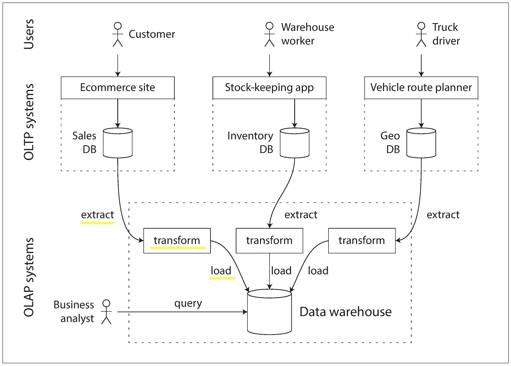
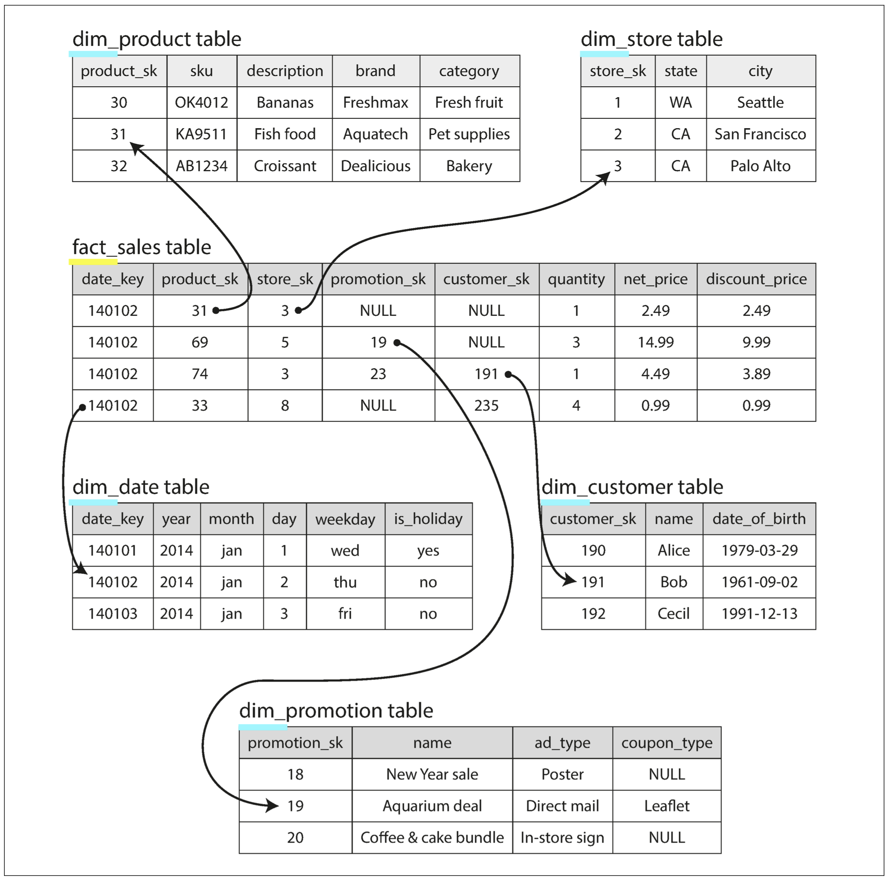
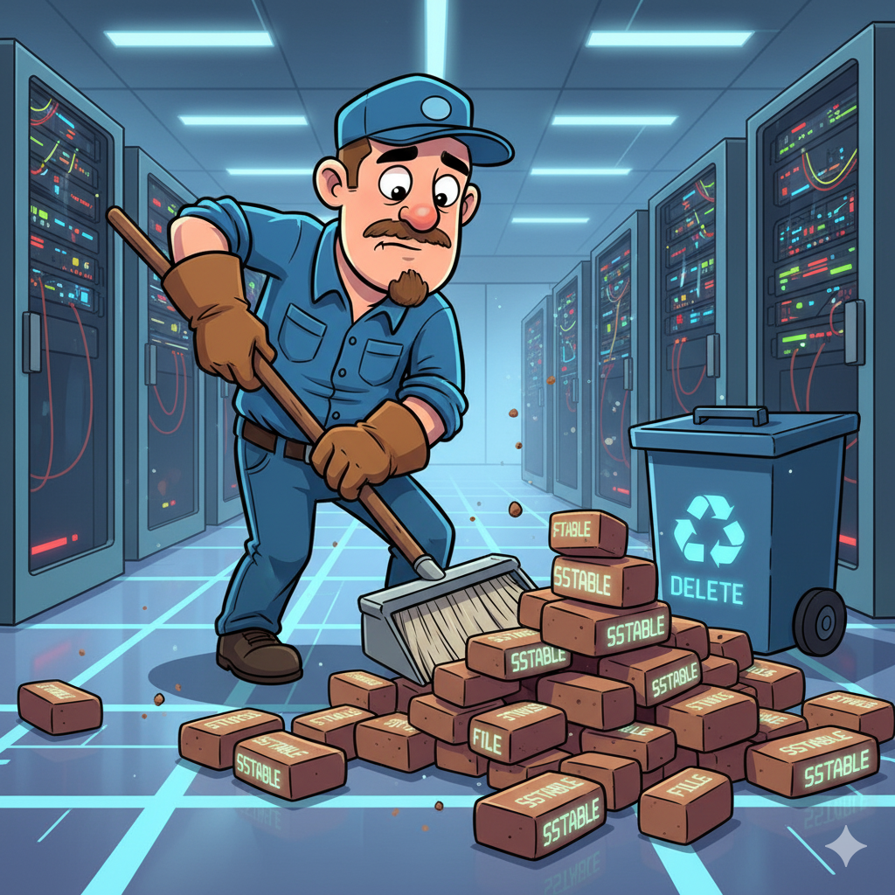
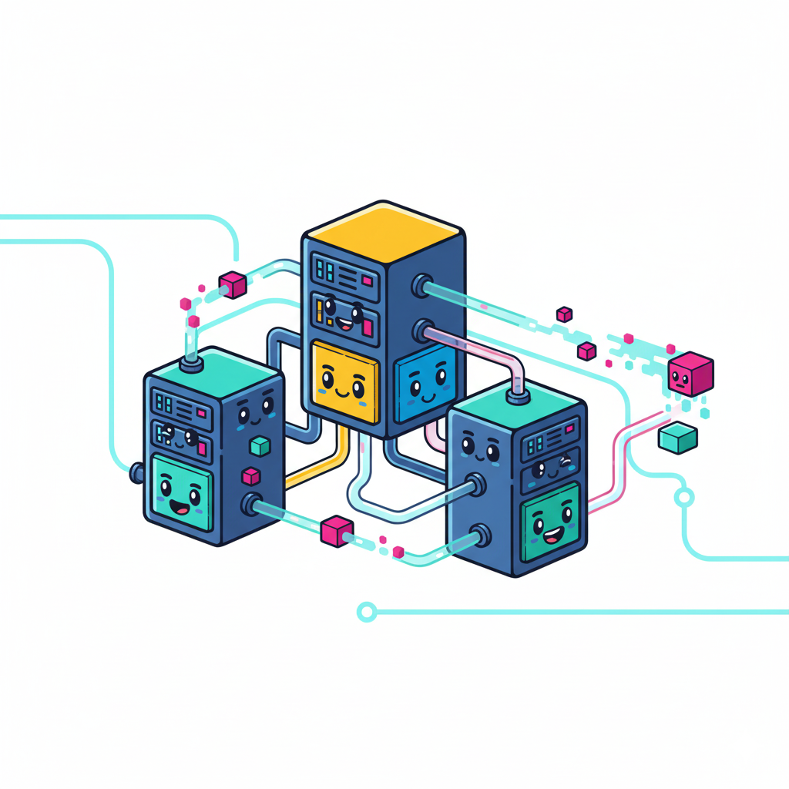
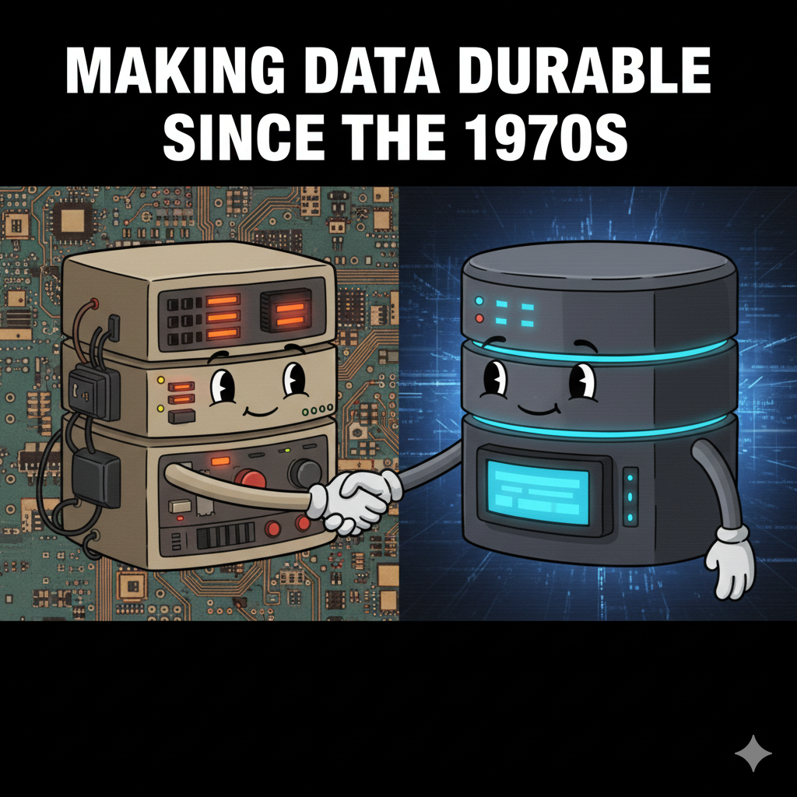

# Transaction Processing

transaction: a group of reads and writes that form a logic unit

Transaction processing: allowing clients to make low-latency reads and writes
Batch processing: periodically run to process a batch, chapter 10
OLTP
<!--
In early days of business a write to the database typically corresponded to a "commercial transaction": making a sales, placing an order
the term stuck referring to a group of reads and writes that form a logic unit
-->

---

# Analytics Processing

OLAP

---

# Comparing OLTP with OLAP

| Property | **Transaction processing systems (OLTP)** | **Analytic systems (OLAP)** |
|----------|---------------------------------------|-------------------------|
| **Main read pattern** | Small number of records per query, fetched by key | Aggregate over large number of records |
| **Main write pattern** | Random-access, low-latency writes from user input | Bulk import (ETL) or event stream |
| **Primarily used by** | End user/customer, via web application | Internal analyst, for decision support |
| **What data represents** | Latest state of data (current point in time) | History of events that happened over time |
| **Dataset size** | Gigabytes to terabytes | Terabytes to petabytes |

---

# Data warehouse

From 1990s companies started using a separate database to run analytics query

ETL: **Extract–Transform–Load**

---

# Divergences between OLTP databases and data warehouses

both have sql query interface
vendor focus on support one only type

Vendor that support both in the same product but behind the scene they use separate storage and query engines
* Microsoft SQL Server
* SAP HANA 

Teradata, Vertica SAP HANA and ParAccel: under expensive commercial licenses
Amazon RedShift is a hosted version of ParAccel
Apache Hive, Spark SQL, Cloudera Impala, Facebook Presto, Apache Tajo, and Apache Drill: OpenSource

Some of them are based on Google's Dremel Research

---

# Stars and Snowflakes

Data warehouse require to handle different data models
dimensional modeling

---

# ⭐ Star Schema

<!--
fact -> event
dimensional -> who, what, where, when, how and why

event date and time can using dimension table, this allow additional info like holidays

each row on fact table is an event that occurs on a particular time
-->

---

# ❄️ Snowflakes Schema

It's a variation of the Start

dimensions are broken into subdimensions 

<!-- dim_product can have dim_brands and dim_category -->

typical data warehouse contains fact tables with easily over 100 columns

dimension tables can be very wide too

---

# Column-Oriented Storage

---

# Column Compression

---

# Sort Order in Column Storage

---

# Writing to Column-Oriented Storage

---

# Data Cubes and Materialized Views

---

# How Data Lives and Breathes  
### A story-driven summary of DDIA Chapter 3: Storage and Retrieval

_A study group presentation by Alex & Simone_

---

## 🧠 Goal for Today
- Understand how data **is stored, retrieved, and kept safe**
- Tell a story, not read a chapter
- Reflect: **how does this apply in our company?**
- End with discussion

🕒 Duration: 1h total

---

## 1️⃣ The Life of a Record
**“Every record starts with a user action.”**

- A click, a save, a form → data is born  
- It must **survive crashes**, **be found quickly**, **scale safely**
- Storage engines are like **ecosystems** where data grows and evolves

> “A database is not a black box — it’s a living organism.”

---

---

## 2️⃣ Two Species of Storage Engines

### 🌳 B-Tree  
- Traditional SQL DBs (Postgres, MySQL)  
- In-place updates on disk pages  
- Great for **reads**, ok for **writes**

### 🌊 LSM-Tree  
- Log-structured merge trees (Cassandra, RocksDB)  
- Write new data sequentially → merge later  
- Great for **writes**, heavier **reads**

> B-Tree = office filing cabinet  
> LSM = inbox + periodic re-filing

---

## 3️⃣ Writing and Crashing

- The **Write-Ahead Log (WAL)** keeps order  
- Steps:
  1. Append to log  
  2. Update in-memory structure  
  3. Flush to disk → commit  
- If crash occurs → **replay the log**

> “If I crash, you’ll remember me.” – The WAL

---

## 4️⃣ Compaction: Keeping Things Tidy

- LSM merges old files into bigger sorted ones  
- Frees space, improves lookup speed  
- Trade-off: uses I/O and CPU  
- Like doing **spring cleaning** for data

---

## 5️⃣ Reading Efficiently

- Databases use **indexes** to find data fast  
- Primary vs Secondary indexes  
- Caches (page cache, memtable)  
- Bloom filters to skip non-existent data  
- Balancing act: **read vs write cost**

> “Reading is easy — unless you wrote too fast.”

---

## 6️⃣ Hardware Realities

- Disk seeks are expensive  
- SSDs are faster, but not magic  
- Buffering and batching are heroes  
- Sequential I/O > Random I/O  

💡 Understanding storage helps design efficient APIs & services

---

## 7️⃣ Real-World Examples

| System | Engine Type | Notes |
|--------|--------------|-------|
| PostgreSQL | B-Tree | WAL + pages |
| MongoDB | WiredTiger (LSM-like) | Compaction heavy |
| Cassandra | LSM | Optimized for writes |
| RocksDB | LSM | Used inside many apps |

> We use these patterns daily, even if we don’t notice.

---

## 8️⃣ Reflection: What about us?

### Let’s look at our stack 👇

| Concept | DDIA Advice | Our Reality |
|----------|--------------|-------------|
| Storage engine | Choose based on workload | ? |
| Indexing | Keep hot paths indexed | ? |
| WAL / durability | Always write before commit | ? |
| Compaction / cleanup | Monitor I/O pressure | ? |

---

## 9️⃣ Key Takeaways

- Every system balances **durability, speed, and simplicity**
- B-Trees and LSMs are not enemies — just **different survival strategies**
- WAL is your best friend during crashes
- Knowing storage internals helps build **better APIs and scalable services**

---

## 1️⃣0️⃣ Discussion Time 💬
**How data moves in *our* company**

Prompts:
- Which systems are more write-heavy vs read-heavy?
- Any painful experiences with compaction, caching, or indexing?
- Do we have visibility into our storage behavior?
- How could DDIA concepts improve performance or reliability?

---

## 🙌 Thank You
Let’s dive into discussion.  
**What does “storage and retrieval” mean for *our* daily work?**
