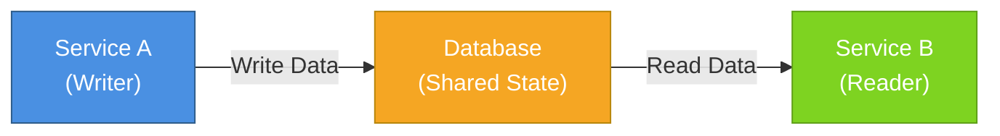
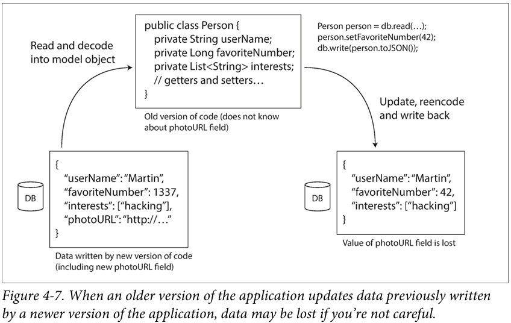
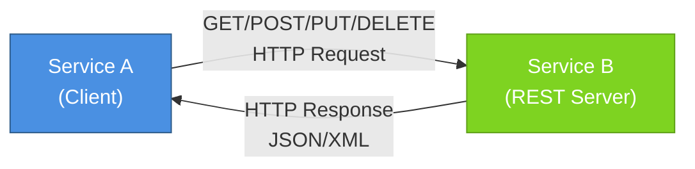
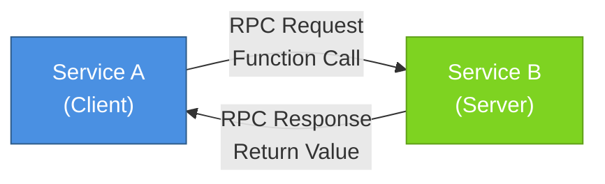
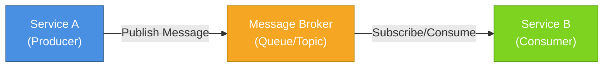

# Part 2: Modes of Data flow

---
class: text-center flex flex-col justify-center items-center gap-16
---

## Via Database

## Via service calls

## Via async message passing

---
class: text-center flex flex-col justify-center gap-8
---
## Dataflow Through Databases

> "sending a message to your future self"



<!--
Example: Scoodle school data sync. Previously it was a direct DB call and fetch teh class information from their DB. It was fragile because we lack the knowledge of their db structure. So we decided to switch to a REST endpoint.
-->

---

### Different values written at different times: Data outlives code



---
class: text-center flex flex-col justify-center items-stretch gap-8
---

## Dataflow Through Services: REST and RPC

### REST 

<hr />

### RPC



---

## Web services

| **SOAP API** | **REST API** |
| -- | -- |
| Relies on SOAP (Simple Object Access Protocol) | Relies on REST (Representational State Transfer) architecture using HTTP. |
| Transports data in standard XML format.	Generally transports data in JSON. It is based on URI. | Because REST follows a stateless model, REST does not enforce message format as XML or JSON etc. |
| Because it is XML based and relies on SOAP, it works with WSDL| It works with GET, POST, PUT, DELETE |
| Works over HTTP, HTTPS, SMTP, XMPP| Works over HTTP and HTTPS |
| Highly structured/typed | Less structured -> less bulky data
Designed with large enterprise applications in mind	| Designed with mobile devices in mind |

---

## The problems with remote procedure calls (RPCs)

- Unpredictability
- Timeout
- Idempotency
- Latency is wildly variable
- Parameter encoding: large objects
- Datatype mismatch

```diff
 const request: NotifyResultSyncRequest = {
    Message: {
-     OrganizationId: "GUID",
      AuthorisationKey: "test-authorisation-key",
      Authorized: "true",
      LastUpdatedBy: "updater",
+     OrganizationId: "GUID",
    },
  };

  const response = await client.NotifyResultSyncAsync(request);
```

<!--
Yesterday example: Calling a Momento Notification Service SOAP endpoint. 1 day investigation to find out the order of message body is strict otherwise always get back a 400 Bad request.
-->

---
class: text-center flex flex-col justify-center items-center gap-8
---

## RESTful API has advantages

> "It doesn’t try to hide the fact that it’s a network protocol"

> "It is good for experimentation and debugging"

<!--
SOAP UI is not the most user friendly tool.
svcutil
-->

---
class: text-center flex flex-col justify-center gap-8
---

## Message-Passing Dataflow




---
mdc: true
---

## Distributed actor frameworks

- logic is encapsulated in actors
- sending and receiving asynchronous messages
- message delivery is not guaranteed
- each actor can be scheduled independently

::block-component{color="red"}
Forward and backward compatibility still an issue
::

### Frameworks

- Akka
- Orleans
- Erlang OTP
