# Part II: Distributed Data

Until now, we've discussed data stored on a **single machine**.

What happens when we need **multiple machines** to store or serve data?

<!--
Part 1 covered foundations: data models, storage engines, encoding. All assumed data lives on one machine.
Now we tackle the harder problem: what happens when one machine isn't enough?
This is where distributed systems complexity begins.
-->

---

# Why Distribute Data?

<v-clicks>

- **Scalability** — Handle more reads, writes, or data volume than a single machine can manage

- **Fault Tolerance** — Keep operating even if some machines fail

- **Latency** — Place data geographically closer to users

</v-clicks>

<!--
Scalability: Your traffic grows, your data grows. One machine has limits.
Fault tolerance: Hardware fails. Disks die. Entire datacenters can go offline. Redundancy is key.
Latency: Users in Tokyo shouldn't wait for a round-trip to a server in London. Data locality matters.
-->

---

# Scaling Up vs Scaling Out

```
┌─────────────────────────────────────────────────────────────────────────────┐
│                                                                             │
│   SCALING UP (Vertical)              SCALING OUT (Horizontal)               │
│   ─────────────────────              ───────────────────────                │
│                                                                             │
│        ┌───────┐                     ┌───┐  ┌───┐  ┌───┐  ┌───┐            │
│        │       │                     │   │  │   │  │   │  │   │            │
│        │ BIG   │                     └───┘  └───┘  └───┘  └───┘            │
│        │ BOX   │                        Shared-Nothing Architecture         │
│        │       │                                                            │
│        └───────┘                     Each node is independent               │
│   Bigger, more expensive             Commodity hardware                     │
│                                                                             │
└─────────────────────────────────────────────────────────────────────────────┘
```

**Scaling up:** Cost grows faster than linearly. Bottlenecks limit gains. Limited fault tolerance.

**Scaling out:** Shared-nothing architecture. Requires distributing data across nodes.

<!--
Scaling up: Buy a bigger machine. 2x the price rarely gives 2x the capacity due to bottlenecks (memory bandwidth, disk I/O, network). Single point of failure remains.
Scaling out: Add more machines. Each node uses its own CPU, RAM, and disks independently. No shared state between machines. This is the shared-nothing model that dominates modern distributed systems.
The catch: now you need to figure out how to distribute your data and coordinate between nodes.
-->

---

# Two Ways to Distribute Data

<div class="grid grid-cols-2 gap-8 mt-8">
<div>

### Replication
Keep a **copy** of the same data on multiple nodes

- Provides **redundancy**
- Reduces latency (serve from nearest replica)
- Increases read throughput

</div>
<div>

### Partitioning
Split a large dataset into **smaller subsets** (shards)

- Each partition lives on a different node
- Enables scaling beyond single-node capacity
- Also called *sharding*

</div>
</div>

<br>

> Often used together: each partition is replicated across multiple nodes.

<!--
Replication: Same data, multiple places. If one node dies, others have the data. Classic redundancy.
Partitioning: Different data on different nodes. A 10TB database split across 10 nodes = 1TB per node. Essential for scaling writes and storage.
In practice, you combine both: partition your data AND replicate each partition. That's how systems like Cassandra, MongoDB, and CockroachDB work.
-->

---

# Chapter 5: Replication

We'll focus on **replication** — keeping a copy of the same data on multiple machines.

Key questions:
- How do changes propagate to all replicas?
- What happens when a replica fails?
- How do we handle concurrent writes?

<!--
Chapter 5 dives deep into replication. We'll cover leader-based replication, handling node failures, replication lag, and consistency guarantees.
Chapter 6 will then cover partitioning.
These two chapters form the foundation for understanding distributed databases.
-->

---

# Why Replicate?

<v-clicks>

- 🌍 **Latency** — Keep data geographically close to users

- 🛡️ **Fault Tolerance** — System continues working even if some nodes fail

- 📈 **Read Scalability** — Scale out to handle more read queries

</v-clicks>

<br>

> We assume the dataset is small enough to fit on a single machine. Partitioning (Chapter 6) handles larger datasets.

<!--
If data never changed, replication would be trivial: just copy it once.
The difficulty lies in handling changes to the data over time.
We have to deal with trade-offs: sync vs async, how to handle failed replicas, consistency guarantees.
-->

---

# The Challenge: Data Changes

If data never changed → just copy once ✅

But data **changes over time** → how do we keep replicas in sync?

<v-click>

### Three main replication algorithms:


</v-click>

<!--
Replication is an old topic, principles haven't changed much since the 1970s.
But network reliability remains a problem, and "eventual consistency" can be a source of subtle bugs.
We'll explore each algorithm and its trade-offs.
-->

---

# Leaders and Followers


<v-clicks>

1. **One replica is the leader** (master/primary) — handles all writes
2. **Others are followers** (read replicas/slaves) — receive replication stream
3. **Reads** can go to leader or any follower

</v-clicks>

<!--
This is leader-based replication, also called master-slave or active-passive.
Built into most relational databases: PostgreSQL, MySQL, Oracle, SQL Server.
Also used by some non-relational databases like MongoDB, RethinkDB, Espresso.
And distributed message brokers like Kafka and RabbitMQ.
-->

---

# Sync vs Async Replication


| | **Synchronous** | **Asynchronous** |
|---|---|---|
| ✅ | Guaranteed up-to-date follower | Leader doesn't block on followers |
| ❌ | One slow follower blocks all writes | Follower may have stale data |

<!--
In practice: semi-synchronous. One follower is sync (guarantee of up-to-date copy), others are async.
If sync follower becomes slow/unavailable, an async one is promoted to sync.
Fully async is common: leader can continue even if all followers fall behind.
Risk: if leader fails and is unrecoverable, any unreplicated writes are lost.
-->

---

# Setting Up New Followers

```mermaid
graph LR
    subgraph Step 1
        L1[Leader] -->|Snapshot| S[Consistent Snapshot]
    end
    
    subgraph Step 2
        S -->|Copy| NF[New Follower]
    end
    
    subgraph Step 3
        L2[Leader] -->|Changes since snapshot| NF
    end
    
    subgraph Step 4
        NF -->|Caught up!| Ready[✓]
    end
```



<v-clicks>

1. Take a **consistent snapshot** of the leader's database
2. **Copy** the snapshot to the new follower node
3. Follower connects and requests all changes **since the snapshot**
4. Follower is **caught up** — ready to serve reads

</v-clicks>

<!--
The snapshot must be associated with an exact position in the replication log.
PostgreSQL calls it "log sequence number", MySQL calls it "binlog coordinates".
Once the follower has processed the backlog of changes, it's caught up.
-->

---

# Handling Node Outages

<div class="grid grid-cols-2 gap-8">
<div>

### Follower Failure
**Catch-up recovery**

- Follower keeps log of data changes
- On restart: request all changes since last processed
- Process backlog → caught up

</div>
<div>

### Leader Failure
**Failover**

- Detect leader has failed (timeout)
- Elect a new leader (replica with most up-to-date data)
- Reconfigure clients & followers to use new leader

</div>
</div>

<!--
Follower failure is straightforward: just catch up from the log.
Leader failover is much trickier. Can be manual or automatic.
Automatic failover has many edge cases and potential issues.
-->

---

# Failover: What Can Go Wrong

<v-clicks>

- 🗑️ **Lost writes** — New leader may not have all updates from old leader. Discarding them is dangerous!

- 🧠 **Split brain** — Old leader comes back, thinks it's still the leader. Two nodes accepting writes = disaster

- ⏱️ **Timeout tuning** — Too short = unnecessary failovers. Too long = longer recovery time

</v-clicks>

<!--
Real example: GitHub 2012 incident. Out-of-date MySQL follower promoted to leader.
Auto-incrementing primary keys got reused, private data got disclosed to wrong users.
Some teams prefer manual failover to avoid these edge cases.
-->

---

# Implementation: Replication Logs

How does the leader send data changes to followers?

<v-clicks>

| Method | How it works |
|--------|--------------|
| **Statement-based** | Send SQL statements (INSERT, UPDATE, DELETE) |
| **Write-ahead log (WAL)** | Ship the append-only storage engine log |
| **Logical (row-based)** | Log row changes at a logical level |
| **Trigger-based** | Application code decides what to replicate |

</v-clicks>

<!--
Each approach has trade-offs in terms of coupling, flexibility, and performance.
Let's look at each one in more detail.
-->

---

# Statement-Based Replication

Leader logs every write statement and sends it to followers.

```sql
INSERT INTO users (name, email) VALUES ('Alice', 'alice@example.com');
UPDATE orders SET status = 'shipped' WHERE id = 123;
DELETE FROM sessions WHERE expires_at < NOW();
```

<v-click>

### Problems ⚠️
- `NOW()`, `RAND()` → different values on each replica
- Autoincrementing columns, triggers, stored procedures
- Side effects must be deterministic

</v-click>

<!--
MySQL used this before version 5.1. VoltDB uses it but requires transactions to be deterministic.
Leader can replace non-deterministic functions with fixed values, but edge cases remain.
Generally not preferred today.
-->

---

# Write-Ahead Log (WAL) Shipping

Send the storage engine's append-only log to followers.

```
┌────────────────────────────────────────────────────┐
│ WAL: byte-level changes to disk blocks             │
│ ─────────────────────────────────────              │
│ Block 42, offset 128: write bytes 0x4A 0x7F ...    │
│ Block 43, offset 0: write bytes 0x12 0x34 ...      │
└────────────────────────────────────────────────────┘
```

<v-click>

### Trade-off ⚠️
- Tightly coupled to storage engine internals
- Different DB versions may have incompatible formats
- **Zero-downtime upgrades become difficult**

</v-click>

<!--
Used by PostgreSQL and Oracle.
If replication protocol doesn't allow version mismatch, you can't do rolling upgrades.
You'd have to take downtime to upgrade all nodes at once.
-->

---

# Logical (Row-Based) Log Replication

Decouple replication log from storage engine format.

```
┌────────────────────────────────────────────────────┐
│ Logical log: row-level changes                     │
│ ─────────────────────────────────────              │
│ INSERT users: id=5, name='Alice', email='...'      │
│ UPDATE orders: id=123 → status='shipped'           │
│ DELETE sessions: id=789                            │
└────────────────────────────────────────────────────┘
```

<v-clicks>

- ✅ Decoupled from storage engine → easier upgrades
- ✅ Backward compatible across versions
- ✅ Easier for external systems to parse (CDC)

</v-clicks>

<!--
MySQL's binlog uses this approach when configured for row-based replication.
Change Data Capture (CDC) tools can read these logs to sync with data warehouses, search indexes, etc.
-->

---

# Trigger-Based Replication

Let application code control replication.

```sql
CREATE TRIGGER replicate_user_changes
AFTER INSERT OR UPDATE ON users
FOR EACH ROW EXECUTE FUNCTION log_change();
```

<v-clicks>

- ✅ Maximum flexibility — replicate subset of data, transform it
- ❌ Greater overhead than built-in replication
- ❌ More prone to bugs

</v-clicks>

<!--
Tools like Oracle GoldenGate, Bucardo for PostgreSQL.
Useful when you need custom logic, but adds complexity.
Prefer built-in replication when possible.
-->

---
layout: cover
class: text-center
---

# Problems with Replication Lag

What happens when followers fall behind?

<!--
Leader-based replication is great for read-heavy workloads.
But with async replication, followers may serve stale data.
This creates "eventual consistency" — but how eventual is eventual?
-->

---

# The Replication Lag Problem


<v-click>

With **read-scaling** (many followers), inconsistency becomes more likely.

If lag grows to minutes → real problems for users.

</v-click>

<!--
Normally lag is a fraction of a second. But under load, or network issues, it can grow.
The system is "eventually consistent" — but apps may need stronger guarantees.
Let's look at specific consistency problems and how to solve them.
-->

---

# Problem 1: Reading Your Own Writes

```mermaid
sequenceDiagram
    participant U as User
    participant L as Leader
    participant F as Follower
    
    U->>L: Update profile
    L-->>U: OK
    U->>F: View profile
    F-->>U: Old data! 😱
```

<div class="grid grid-cols-2 gap-4">
<div>



</div>
<div>

User makes a change, then sees **old data**.

Looks like their change was lost!

</div>
</div>

<!--
Classic example: user updates their profile, refreshes the page, and their old data is shown.
They might try submitting again, causing confusion.
We need "read-after-write consistency" (also called "read-your-writes consistency").
-->

---

# Solution: Read-After-Write Consistency

<v-clicks>

- **Read from leader** for data user may have modified
  - e.g., always read user's own profile from leader

- **Track recent write time** — read from leader for ~1 minute after any write

- **Client remembers timestamp** of most recent write
  - Replica must be caught up to that timestamp before serving reads

</v-clicks>

<v-click>

### Complications ⚠️
- Cross-datacenter: may need to route to leader's datacenter
- Cross-device: timestamp/metadata must be centralized

</v-click>

<!--
If most things are editable by user, you might have to read everything from leader (negating read scaling).
Logical timestamp approach is more flexible but requires coordination.
Cross-device adds complexity: my phone and laptop need to agree on "most recent write".
-->

---

# Problem 2: Moving Backward in Time

```mermaid
sequenceDiagram
    participant U as User
    participant F1 as Follower 1
    participant F2 as Follower 2
    
    U->>F1: Read → sees new comment
    U->>F2: Read → comment gone! 😱
    Note over F2: F2 is behind F1
```



User sees **newer data, then older data** on refresh.

Time appears to go backwards!

<!--
Example: user sees a comment, refreshes, comment disappears.
Very confusing user experience.
Happens when different requests hit different replicas with different lag.
-->

---

# Solution: Monotonic Reads

Guarantee: user will **never see older data after seeing newer data**.

<v-click>

### Implementation
- Route each user to the **same replica** (e.g., hash of user ID)
- If that replica fails, reroute to another

</v-click>

<!--
Monotonic reads is a weaker guarantee than strong consistency, but stronger than eventual consistency.
Simple to implement: just make users "sticky" to replicas.
-->

---

# Problem 3: Causality Violations

<div class="grid grid-cols-2 gap-4">
<div>


</div>
<div>

Answer appears **before** the question!

Causal order is violated.

</div>
</div>

<!--
Consistent prefix reads: if a sequence of writes happens in a certain order, anyone reading must see them in the same order.
This is particularly tricky in partitioned databases.
-->

---

# Solution: Consistent Prefix Reads

Guarantee: if writes happen in order A → B, readers see A before B.

<v-click>

### Implementation
- Causally related writes go to the **same partition**
- Use algorithms that track causal dependencies

</v-click>

<!--
Partitioned databases make this harder because there's no global ordering of writes.
We'll revisit causality and ordering in later chapters.
-->

---

# Dealing with Replication Lag

<v-clicks>

- **Eventual consistency** is real — lag can be seconds, minutes, or more

- If your app can't tolerate lag → need **stronger guarantees**:
  - Read-after-write consistency
  - Monotonic reads
  - Consistent prefix reads

- Worth thinking about: **how should your app behave** when consistency is delayed?

</v-clicks>

<!--
Transactions existed to hide these complexities. But distributed systems moved away from them for performance.
Now we're reinventing these guarantees at the application level.
It's worth designing your app to handle temporary inconsistency gracefully.
-->

---
layout: cover
class: text-center
---

# Summary: Leader-Based Replication

<!--
Let's recap what we've covered so far about leader-based replication.
-->

---

# Key Takeaways

<v-clicks>

- **Leader-based replication**: writes to leader, replicated to followers
- **Sync vs Async**: durability vs performance trade-off
- **Failover is hard**: lost writes, split brain, timeout tuning
- **Replication lag** causes consistency issues
- **Consistency guarantees**: read-your-writes, monotonic reads, consistent prefix

</v-clicks>

<v-click>

### Coming up next...
Multi-leader and leaderless replication

</v-click>

<!--
Leader-based replication is the most common approach, but it has limitations.
Single leader = single point of failure for writes.
Next session we'll explore alternatives: multi-leader and leaderless replication.
These enable more availability and handle network partitions differently.
-->
