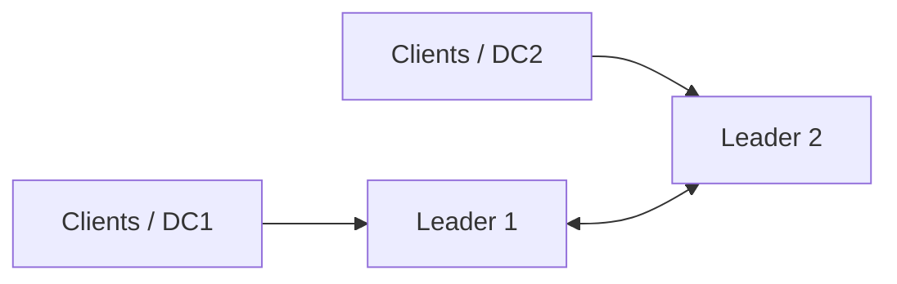
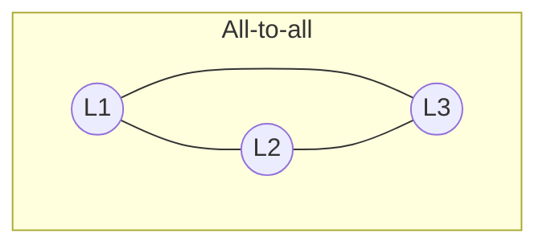
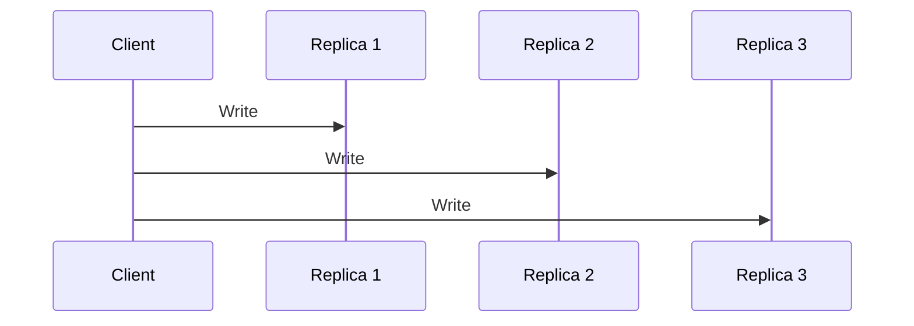
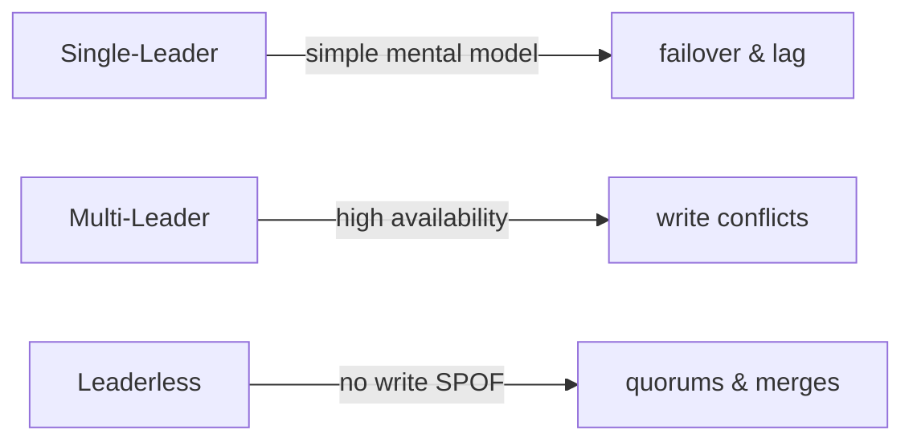

## Recap: Why Go Beyond Single-Leader?

Single-leader replication is simple and widely used, but it has limitations:

<v-clicks>

- A **single write bottleneck**
- Higher write latency in **multi-region deployments**
- Availability issues during **leader failure or network partitions**
- Difficulties supporting **offline writes**

- Multi-leader and leaderless replication are responses to these limitations.

</v-clicks>

---

## Multi-Leader Replication: Overview

In multi-leader replication, **multiple nodes can accept writes**.

Each leader:
- Accepts writes from local clients
- Replicates changes asynchronously to other leaders
- May receive concurrent, conflicting updates

This model increases availability and reduces latency,
but introduces **write conflicts** as a fundamental challenge.

---

## Typical Use Cases for Multi-Leader Replication

### Multi-Datacenter Deployments
- Each datacenter has a local leader
- Writes do not need to cross regions synchronously
- System can continue operating even if regions are temporarily disconnected

### Offline-First Applications
- Mobile or desktop apps accept writes while offline
- Changes are synchronized when connectivity is restored
- Conflicts are resolved during synchronization

### Collaborative Editing
- Multiple users edit the same data concurrently
- Conflicts are expected and must be resolved semantically
- Often combined with domain-specific merge logic

---

## The Core Challenge: Write Conflicts

<v-clicks>

Because multiple leaders accept writes concurrently:

- Two or more leaders may update the same record at the same time
- Conflicts are detected **after replication**, not at write time
- Some conflicts violate business rules rather than data structure

Example:
- Two users book the same meeting room
- Each leader checks availability locally
- Both bookings succeed
- Conflict emerges only when updates are replicated

These conflicts cannot always be resolved automatically.

</v-clicks>

---

## When Authority Breaks Down

<v-clicks>

- In multi-leader systems, there is no single source of truth.
- Sometimes, multiple nodes believe they are “in charge”.

## Both replicas think they’re the leader:
 

Funny, yeah. But in production this actually is how you lose data.
</v-clicks>

---

## Replication Topologies

Replication topology defines **how leaders propagate writes**.

Common approaches:
- **All-to-all**: every leader replicates to every other leader
- **Star**: one central leader forwards writes
- **Tree / Circular**: simpler but more fragile

All-to-all provides better fault tolerance but introduces ordering problems.

---

## Ordering, Causality, and Overtaking

In multi-leader systems, messages may arrive out of order.

Example:
1. Leader A inserts a row
2. Leader B updates the same row
3. Leader C receives the update before the insert

Result:
- Update references non-existent data
- Causal ordering is violated

Clock timestamps alone are insufficient.
Systems must track **causal dependencies** between writes.

---

## Leaderless Replication: Removing the Leader

Leaderless replication removes the concept of a leader entirely.

Characteristics:
- Any replica can accept writes
- Clients coordinate writes and reads
- The system prioritizes availability over consistency

This model is inspired by Amazon Dynamo.

---

## Quorum-Based Reads and Writes

Leaderless systems rely on **quorums**.

Definitions:
- **n**: total number of replicas
- **w**: replicas that must acknowledge a write
- **r**: replicas queried for a read

If **w + r > n**, there is overlap between reads and writes,
increasing the likelihood of reading the latest value.

Common configuration:
- n = 3 or 5
- w = r = majority

This is a *best-effort* guarantee, not a strict one.

---

## Replica Synchronization Without Logs

Without a leader, replicas diverge naturally.

Two mechanisms help convergence:

### Read Repair
- Detect stale replicas during read operations
- Update them asynchronously

### Anti-Entropy
- Background processes compare replicas
- Missing updates are copied over time

Anti-entropy ensures eventual consistency,
even for rarely accessed data.

---

## Sloppy Quorums

When some replicas are unreachable:

- Writes may be accepted by any reachable node
- The system still waits for **w acknowledgements**
- The write may not land on the intended replicas

This improves availability during partitions,
but weakens read consistency guarantees.

---

## Hinted Handoff

Temporary replicas store data on behalf of unavailable nodes.

- Data is tagged with a "hint" indicating the intended destination
- When the original node recovers, data is handed back

Hinted handoff is effective for short outages,
but not a replacement for anti-entropy.

---

## Handling Conflicts: Siblings

<v-clicks>
Concurrent writes may result in multiple versions of the same record.

- Databases may return **all versions** to the client
- These versions are often called *siblings*
- Applications are responsible for merging or choosing

</v-clicks>

---

## Leaderless Replication Be Like
<v-clicks>

> “I don’t know which one is right. You decide.”

</v-clicks>

## Conflict Resolution Is Application Logic

<v-clicks>

- Some merges are easy (set union)
- Deletes require tombstones
- Some conflicts cannot be auto-resolved

</v-clicks>

---

## Deletes and Tombstones

Deletes are represented as **tombstones**.

- A tombstone marks data as deleted
- Prevents deleted data from being resurrected by old replicas
- Tombstones must eventually be garbage-collected

Incorrect handling of deletes is a common source of bugs.

---

## Detecting Concurrency with Version Vectors

Simple version counters do not work with multiple writers.

Leaderless systems use **version vectors**:
- One counter per replica
- Reads return the full vector
- Writes include the vector back

This allows the system to distinguish:
- Causally ordered updates
- Truly concurrent updates

---

## Comparing Replication Models

There is no universally best model.
Each choice reflects a different trade-off.

---

## Key Takeaways

Chapter 5 is really about how removing a single source of truth increases availability, but forces us to confront ordering, causality, and conflict head-on.

**Understanding these trade-offs is essential for system design**:

<v-clicks>

- **Increasing availability increases complexity**
- **Multiple writers imply conflict resolution**
- **Leaderless systems push consistency concerns to applications**

</v-clicks>
---

## Transition to Next Chapter

Next, we will look at **partitioning (sharding)**,
which addresses scalability beyond a single dataset copy.
