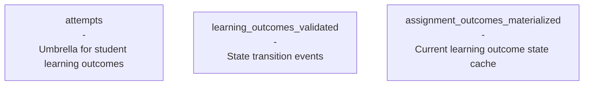
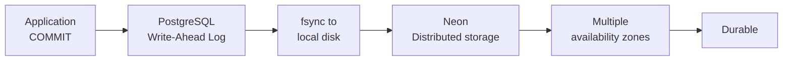

# ACID in Odin

## How Chapter 7 concepts show up in our real PostgreSQL system

<!--
Let's have a look how ACID properties work in practice in R&I.
-->

---

# Our Database Setup

**Three core tables** tracking student assessments:

<v-clicks>

**Why assignment_outcomes_materialized?**
- Event sourcing: `learning_outcomes_validated` has millions of events
- Materialized table gives O(1) current state lookup

**Insert-only architecture:**
- PRO: Simple concurrency model, no lost updates
- PRO: Complete audit trail, immutable history
- CON: Storage overhead, background cleanup needed

</v-clicks>

<!--
This is Odin in a nutshell.
We track student progress through learning outcomes using event sourcing.

We have three tables:
Attempts table: grouping entity for student learning outcomes.
Learning outcomes validated: every event when a learner or teacher interacts with a result, each with a state (Started, Answered, Completed, etc).
Assignment outcomes materialized: current state of the learning outcomes for a student and assignment derived from all events.
...
Why materialize learning outcomes? Pure event sourcing means scanning millions of events to get current state. Materialized table gives us O(1) lookups.
...
Our architecture is insert-only: we never UPDATE or DELETE. Only INSERT new records.
This simplifies concurrency and gives us an audit trail.
-->

---

# Maintaining Consistency Through Atomicity

**The problem:** Keep assignment outcomes materialized table in sync

<v-clicks>

**Two triggers in one atomic transaction:**
1. BEFORE: Validate state machine (Initialized → Started ✅, Completed → Answered ❌)
2. AFTER: Update materialized view with new state

**All-or-nothing guarantee:**
- If validation fails → no event written
- If materialization fails → event is rolled back
- **Never** have inconsistent state between tables

</v-clicks>

<!--
The problem of keeping learning outcomes validated and assignment outcomes materialized is the classic email + counter problem from the book.

When you insert a learning outcome, two things must happen:
1. Write the event
2. Update the materialized view

We use triggers to keep them in sync atomically.

BEFORE trigger validates state transitions. Can't go from Completed to Answered.
AFTER trigger updates the materialized table.

If either fails, the whole transaction rolls back. We get consistency through atomicity.
-->

---

# Read Committed Isolation: Our Reality

**PostgreSQL default:** Read Committed isolation level

<v-clicks>

**What Read Committed Gives Us:**
- No dirty reads - Never see uncommitted data
- No dirty writes - Row locks prevent conflicts

</v-clicks>

<v-clicks>

**Race condition we discovered:**

Two concurrent inserts with a valid state transition

**Real impact:**
- Both transitions were individually valid
- Materialized view uses latest event (ORDER BY id DESC)
- Happens rarely in practice, mostly harmless duplicates

</v-clicks>

<!--
We use PostgreSQL's default Read Committed isolation.

It prevents the obvious problems: dirty reads and writes. Dirty writes. Dirty writes were already prevented by insert only architecture
Our triggers work atomically.

But it doesn't prevent everything. We found a real race condition.

Our BEFORE trigger validates transitions by reading current state.
If two sessions read "Started" simultaneously and both insert "Answered",
both pass validation because both transitions are valid.

The impact? We get duplicate events. Not ideal, but our materialized view
uses the latest event, so the final state is still correct.

This happens rarely in practice -
We have over 1,100,000,000 learning outcome events, ~363075 race conditions events, 0,03196
Most of them are harmless duplicates. Actual wrong transitions are 1466, that's 0,000129%. Only one transition per 300,000
The cost of preventing it (SELECT FOR UPDATE or Serializable) isn't worth it.
-->

---

# Why We Accept Weak Isolation

**The trade-offs we made:**

<v-clicks>

**Performance over perfect consistency**

**Insert-only architecture helps**

**Risk assessment:**
- Duplicate events: annoying but harmless
- Wrong transitions: rarely happens in practise 

</v-clicks>

<!--
We consciously chose Read Committed over Serializable.

Serializable isolation would prevent our race condition completely.
But it comes with significant performance costs and transaction aborts.

For our use case - race conditions are undesired but luckily almost never happens.
Duplicate events are annoying but don't break anything.

We tried a different approach in the past with Kafka, this gave us serializability but at a high cost of complexity and performance. When working in practice with hte platforms we also saw the need for transactions for inserting new events.

Our insert-only architecture eliminates the worst concurrency bugs.
We accept the remaining edge cases as a reasonable trade-off.
-->

---

# Durability: Not Our Problem

**PostgreSQL + Neon handles this for us:**

<v-clicks>

**We trust the infrastructure:**
- PostgreSQL's WAL + fsync for local durability  
- Neon's distributed storage across multiple AZs
- We focus on application logic, not storage reliability

</v-clicks>

<!--
Lastly abut durability, is the one ACID property we completely delegate.

PostgreSQL handles local durability with write-ahead logging and fsync.
Neon handles distributed durability across multiple availability zones.

We don't think about disk crashes or power failures.
The database infrastructure handles that.

-->

---

# Lessons Learned

<v-clicks>

**ACID is about trade-offs, not absolutes:**
- We get atomicity and durability for free
- We design around isolation limitations  
- Consistency requires application logic (validation functions)

**Know your isolation level:**
- Read Committed prevents dirty reads/writes
- Doesn't prevent race conditions
- Design your application accordingly

**Architecture matters more than isolation level:**
- Insert-only eliminates lost updates
- Event sourcing + materialization handles concurrency gracefully
- Choose your failure modes wisely

</v-clicks>

<!--
The big lesson: ACID isn't binary. You get some guarantees automatically, others require design.

Know exactly what your isolation level provides. Don't assume.
Read Committed is weaker than you think, but often sufficient.

Architecture choices matter more than isolation level.
Our insert-only approach eliminates entire classes of concurrency bugs.

Finally, understand your actual requirements. Perfect consistency sounds nice,
but comes with real costs. Choose based on your actual needs, not fear.
-->
