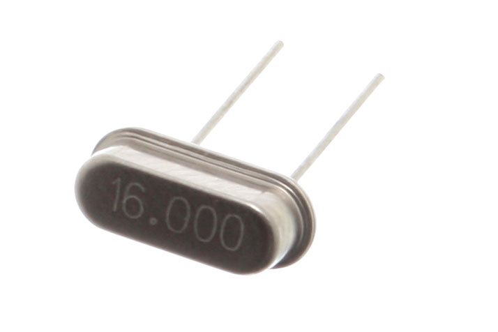

<!-- # The Trouble with Distributed Systems -->

<div class="text-center mt-20">
<div class="text-6xl mb-8">💀</div>
<p class="text-2xl text-gray-400">"Everything that can go wrong, will go wrong"</p>
<p class="text-lg text-gray-500 mt-4">Networks, Clocks & Partial Failures</p>
</div>

<!--

This is the most pessimistic chapter in the book.

We'll cover unreliable networks, unreliable clocks, and why partial failures make everything hard.
-->

---

# A Pessimistic Worldview

<div class="grid grid-cols-2 gap-8 mt-8">
   <div>

<v-clicks>

- "In distributed systems: **suspicion, pessimism, and paranoia pay off**"
- Assume components can be slow or faulty:
  - the network
  - the clocks
  - other nodes
- **Partial failures** are the norm, not the exception

</v-clicks>

   </div>
<div class="flex items-center justify-center">


</div>
</div>

<!--
The key mindset for this chapter: assume everything is broken.

[click] In distributed systems, suspicion, pessimism, and paranoia pay off.

[click] Assume components can be slow or faulty: the network, clocks, other nodes.

[click] Partial failures are the norm. Unlike a single computer where things work or don't, distributed systems can be partially working and partially failing at the same time.
-->

---

# Networks Are Unreliable

<div class="grid grid-cols-2 gap-8 mt-4">
<div>

**When you send a request, what can happen?**

<v-clicks>

1. ✅ Request arrives, response comes back
2. ❌ Request is lost (never arrives)
3. ❌ Request waits in a queue (delayed)
4. ❌ Remote node crashed
5. ❌ Remote node is slow (temporary overload)
6. ❌ Response is lost on the way back
7. ❌ Response is delayed in a queue

</v-clicks>

</div>
<div>

<v-click>

```
┌─────────┐          ┌─────────┐
│ Client  │──────────│ Server  │
└─────────┘          └─────────┘
     │                    │
     │   Request ──?──►   │
     │                    │
     │   ◄──?── Response  │
     │                    │

   "No response ≠ failed request"
```

</v-click>

</div>
</div>

<v-click>

<div class="mt-4 p-4 bg-red-900/30 rounded-lg">

**From the sender's perspective:** lost request, crashed node, slow node, lost response — they all look the same: **silence**.

</div>

</v-click>

<!--
When you send a network request, many things can happen.

[click] The happy path: request arrives, response comes back.

[click] Or the request is lost and never arrives.

[click] Or it waits in a queue somewhere.

[click] Or the remote node crashed.

[click] Or the remote node is just slow.

[click] Or the response gets lost on the way back.

[click] Or the response is delayed.

[click] And here's the thing — from the sender's perspective, all these failures look identical. You can't tell. All you get is silence. No response. That's it.

So what's our only option? We need some mechanism to eventually give up and declare failure...
-->


---

# Timeouts: Our Only Tool

<div class="mt-8">

**Since all failures look like silence, our only option is to wait... then give up.**

But how long do you wait?

<v-clicks>

- **Too short:** False positives — suspect slow nodes as failed
- **Too long:** Users wait forever, system appears hung

</v-clicks>

</div>

<v-click>

<div class="mt-8 grid grid-cols-2 gap-8">
<div class="p-4 bg-yellow-900/30 rounded-lg">

**Short timeout risks:**
- Cascading failures
- Unnecessary failovers
- Duplicate actions (retry storm)

</div>
<div class="p-4 bg-blue-900/30 rounded-lg">

**Long timeout risks:**
- Poor user experience
- Slow failure detection
- Resource starvation (waiting threads)

</div>
</div>

</v-click>

<!--
Since we can't tell what went wrong, the only option left is to wait... and eventually give up. That's a timeout.

[click] Too short: you get false positives. You treat "slow" as "dead" and trigger retries/failovers.

[click] Too long: users wait forever. Your system feels hung.

[click] Let me break down the specific risks. On the left: cascading failures, unnecessary failovers, retry storms. On the right: poor user experience, slow failure detection, resource starvation.

So picking the right timeout is critical. But here's the thing — it's actually impossible to pick a "correct" one. Let me show you why...
-->

---

# Why Delays Are Unbounded

<div class="text-center mt-4 text-xl">

**Why can't we just pick the "right" timeout? Because async networks have no maximum delay bound.**

</div>

<v-click>

```
┌─────────────────────────────────────────────────────────────────────────┐
│                        THE JOURNEY OF A PACKET                          │
├─────────────────────────────────────────────────────────────────────────┤
│                                                                         │
│  App ──► OS Buffer ──► NIC ──► Switch Queue ──► Router ──► ... ──►     │
│                                    │                                    │
│                          (📦 packets waiting)                          │
│                                                                         │
│  ... ──► Router ──► Switch ──► NIC ──► OS Buffer ──► App               │
│                        │                    │                           │
│               (📦 more waiting)    (even more waiting!)                │
│                                                                         │
└─────────────────────────────────────────────────────────────────────────┘
```

</v-click>

<v-click>

<div class="mt-4 text-sm">

**Queueing can happen at many steps:** network switches, routers, OS buffers, hypervisors, receiving application

</div>

</v-click>

<!--
We just said picking a timeout is hard. Here's why — there's no guaranteed maximum delay.

[click] Look at the journey of a packet. It goes through your app, OS buffer, network card, switch queues, routers, more switches, back through OS buffers, finally to the receiving app.

[click] Queueing can happen at many steps. Network switches, routers, OS buffers, hypervisors, the receiving application. These delays are variable and unpredictable.

Let's look at exactly where packets get stuck...
-->

---

# Congestion & Queueing: Where Packets Get Stuck

<div class="mt-4">

**Every hop is a potential delay point:**

<v-clicks>

1. **Network switch** — if port is busy, packets queue (or get dropped!)
2. **OS kernel** — incoming data buffered before app reads it
3. **Virtualized environments** — VM might be paused while others run
4. **TCP flow control** — sender limits rate when receiver is slow
5. **TCP congestion control** — detects packet loss, slows down. Good for the network, bad for your latency
6. **Receiving application** — GC pauses, busy threads

</v-clicks>

</div>

<v-click>

<div class="mt-4 p-4 bg-yellow-900/30 rounded-lg">

TCP adds even more delay through **retransmission** — when packets are lost, it resends them. What if we just... don't?

</div>

</v-click>

<!--
Let's go deeper on where delays come from.

[click] Network switches have limited buffer space. If traffic comes in faster than it can go out, packets queue. If the buffer fills, packets are dropped.

[click] OS kernel buffers incoming data before your app reads it.

[click] In virtualized environments, your VM might be paused while the hypervisor runs other VMs. To the guest OS, time just stops.

[click] TCP flow control limits the sender when the receiver is slow.

[click] TCP also has built-in congestion control. When it detects packet loss, it slows down.

[click] And the receiving application might be doing garbage collection. Java GC pauses can be 100ms or more.

[click] On top of all this, TCP retransmits lost packets — adding even more delay. Which leads to an interesting question: what if we just skip retransmission entirely?
-->

---

# UDP: When Retransmission Hurts

<div class="mt-8">

**Why do real-time apps often use UDP instead of TCP?**

<v-clicks>

- TCP guarantees delivery by **retransmitting** lost packets
- For real-time media: an old packet is often **useless**
- Better to skip the frame than delay the stream
- UDP: "Fire and forget" - no retransmission, no ordering, no retransmission-induced delay

</v-clicks>

</div>

<v-click>

<div class="mt-6 p-4 bg-gray-400 rounded-lg">

**Trade-off:**
- TCP: Reliable but unpredictable latency
- UDP: Predictable latency but potential data loss

Choose based on what matters more to your application.

</div>

</v-click>

<!--
Why do real-time apps often use UDP instead of TCP?

[click] TCP guarantees delivery by retransmitting lost packets.

[click] For real-time media, a late packet is often useless. The conversation/game has moved on.

[click] Better to skip the frame than delay the stream.

[click] UDP is "fire and forget" at the transport layer: no retransmission, no in-order delivery. Network delay still exists — you’re just not adding extra delay by waiting for missing packets.

[click] It's a trade-off. TCP: reliable but latency can spike under loss. UDP: lower latency variance, but you must tolerate loss.
-->

---

# Dynamic Timeouts

<div class="mt-8">

**Whether TCP or UDP, delays remain variable. Static timeouts can't keep up.**

<v-click>

**Solution: Adapt based on observed behavior**

</v-click>

<v-clicks>

- Measure response times over an extended period
- Track variance, not just average
- Adjust timeout dynamically

</v-clicks>

</div>

<!--
Whether you use TCP or UDP, delays are variable. A static timeout will always be wrong — either too aggressive or too conservative.

[click] The solution: adapt based on observed behavior.

[click] Measure response times over an extended period, not just recent ones.

[click] Track variance, not just average. A p99 spike matters more than the mean.

[click] Adjust timeout dynamically.

But this raises a deeper question: WHY do we need dynamic timeouts at all? Why can't the network just guarantee bounded delay? That brings us to how networks are fundamentally designed...
-->

---

# Synchronous vs Asynchronous Networks

<div class="text-sm text-gray-400 mb-4">Why can't the network just guarantee bounded delay?</div>

<div class="grid grid-cols-2 gap-8">
<div>

**Phone Networks (Circuit-switched)**

<v-clicks>

- Dedicated bandwidth per call
- Reserved capacity end-to-end
- More predictable latency (bounded delay in principle)
- Inefficient: bandwidth wasted when silent

</v-clicks>

</div>
<div>

**Internet (Packet-switched)**

<v-clicks>

- Share bandwidth dynamically
- **No guarantees** - best effort only
- Variable latency (unbounded delay)
- Efficient: only use what you need

</v-clicks>

</div>
</div>

<v-click>

<div class="mt-6 p-4 bg-blue-900/30 rounded-lg text-center">

Packet switching trades strict guarantees for flexibility and efficiency

</div>

</v-click>

<!--
Why can't the network just guarantee bounded delay? Compare it to phone networks.

Phone networks are circuit-switched.

[click] Dedicated bandwidth per call.

[click] Reserved capacity end-to-end.

[click] More predictable latency - bounded delay in principle.

[click] But inefficient: bandwidth wasted when you're silent.

[click] Now the internet - packet-switched. Share bandwidth dynamically.

[click] No guarantees - best effort only.

[click] Variable latency - unbounded delay.

[click] But efficient: only use what you need.

[click] Packet switching trades strict guarantees for flexibility and efficiency — great for utilization, but it means delays are variable.
-->

---

# Can We Make the Internet More Reliable?

<div class="mt-8">

**QoS (Quality of Service) and Admission Control**

<v-clicks>

- Prioritize certain types of traffic
- Reserve bandwidth for real-time applications
- Rate-limit senders to prevent congestion
- **Can** emulate circuit-switching behavior

</v-clicks>

</div>

<v-click>

<div class="mt-6 p-4 bg-yellow-900/30 rounded-lg">

**But in practice:**
- Internet QoS is rarely enabled
- Requires cooperation across networks
- Multi-tenant datacenters can't predict neighbor traffic
- Cost/benefit often doesn't justify the complexity

</div>

</v-click>

<!--
Can we make the internet more reliable? There are techniques.

QoS - Quality of Service - and Admission Control.

[click] Prioritize certain types of traffic.

[click] Reserve bandwidth for real-time applications.

[click] Rate-limit senders to prevent congestion.

[click] You CAN emulate circuit-switching behavior.

[click] But in practice, almost nobody does this. Requires cooperation across networks. In cloud environments, you can't control your neighbor's traffic. Cost-benefit often doesn't work out.

So we're stuck with unreliable networks. Build your systems accordingly.

But networks aren't the only thing that's unreliable in distributed systems. There's another fundamental problem: machines can't even agree on what time it is.
-->

---
layout: section
---

# Unreliable Clocks

<!--
We've accepted the network is unreliable. But there's another fundamental problem in distributed systems: machines can't even agree on what time it is.

Each machine has its own clock. They're not synchronized. They drift. And as we'll see, this causes real problems.
-->

---

# How Computers Keep Time

<div class="grid grid-cols-2 gap-8 mt-4">
<div>

Distributed systems rely on clocks for **durations** (timeouts, latency) and **points in time** (ordering, validity). But how do computers actually keep time?

**Quartz Crystal Oscillator**

<v-clicks>

- Every computer has one
- Vibrates at a known frequency
- Counts oscillations → tracks time
- **Problem:** They drift!

</v-clicks>

<v-click>

<div class="mt-2 p-3 bg-gray-400 rounded-lg text-sm">

**Clock Drift:** ~1 second/day (commodity hardware). Worse with temperature changes, cheap crystals, aging. Over a month: **minutes off!**

</div>

</v-click>

</div>
<div class="flex items-center justify-center">



</div>
</div>

<!--
Distributed systems rely on clocks for two things: measuring durations (like timeouts) and pinning down points in time (like "which write happened first?").

But how do computers actually keep time? With a quartz crystal oscillator. This is what one looks like.

[click] Every computer has one.

[click] It vibrates at a known frequency.

[click] Count oscillations, track time.

[click] But crystals aren't perfect. They drift!

[click] Think of it like a cheap wristwatch — runs a bit fast or slow. A decent clock might drift a few seconds per day; bad hardware or temperature changes can be much worse. Leave a server running for a month without sync? It could be minutes off.

So how do we fix this drift? NTP.
-->

---

# NTP: Network Time Protocol

<div class="mt-4">

**How machines synchronize their clocks**

<v-clicks>

- Connect to servers with accurate time (often GPS-based)
- Measure round-trip delay, estimate offset
- Adjust local clock to match

</v-clicks>

</div>

<v-click>

```
┌──────────┐                    ┌──────────┐
│  Client  │ ── "What time?" ──►│   NTP    │
│          │                    │  Server  │
│  12:00:00│ ◄── "12:00:01" ────│ 12:00:01 │
└──────────┘                    └──────────┘
      │
      ▼
  Adjust clock by ~1 second
  (accounting for network delay)
```

</v-click>

<v-click>

<div class="mt-4 p-4 bg-yellow-900/30 rounded-lg">

**NTP problems:** Network delays vary, leap seconds cause jumps, misconfigured servers exist

</div>

</v-click>

<!--
NTP — Network Time Protocol — is how computers synchronize their clocks.

[click] Connect to servers with accurate time, often GPS-based.

[click] Measure round-trip delay, estimate offset.

[click] Adjust local clock to match.

[click] Here's how it works visually. Your computer asks "what time is it?" The NTP server responds. You adjust your clock, accounting for network delay.

[click] But NTP has problems. Network delays vary. Leap seconds cause jumps. Misconfigured servers exist. On a LAN you might get millisecond-ish accuracy; across the internet it can be tens of milliseconds or worse.

NTP syncs clocks, but WHICH clock exactly? Your computer actually has two very different types of clocks...
-->

---

# Time-of-Day Clocks

<div class="mt-8">

**Returns "wall clock" time - what you'd see on a clock**

<v-clicks>

- `System.currentTimeMillis()` (Java)
- `Date.now()` (JavaScript)
- `time.time()` (Python)
- Usually synced with NTP
- Measured in seconds/milliseconds since epoch (Jan 1, 1970)

</v-clicks>

</div>

<v-click>

<div class="mt-6 p-4 bg-red-900/30 rounded-lg">

**⚠️ Danger: Time-of-day clocks can JUMP**

- NTP sync causes sudden adjustments
- Clock can move **backward**!
- Leap seconds cause weird behavior

</div>

</v-click>

<!--
Time-of-day clocks return "wall clock" time. What you'd see on a clock.

[click] In Java: System.currentTimeMillis.

[click] In JavaScript: Date.now.

[click] In Python: time.time.

[click] Usually synced with NTP.

[click] Measured in milliseconds since January 1, 1970.

[click] But here's the danger: time-of-day clocks can JUMP. NTP adjusts your clock. It can move backward! Imagine measuring duration: start at 12:00:00, NTP adjusts, end at 11:59:59. Duration: negative one second? Never use time-of-day clocks for duration!
-->

---

# Monotonic Clocks

<div class="mt-8">

**Designed for measuring elapsed time**

<v-clicks>

- `System.nanoTime()` (Java)
- `performance.now()` (JavaScript)
- `time.monotonic()` (Python)
- Not stepped by NTP (shouldn't go backward)
- Not tied to wall-clock time

</v-clicks>

</div>

<v-click>

<div class="mt-6 grid grid-cols-2 gap-4">
<div class="p-4 bg-green-900/30 rounded-lg">

**✅ Good for:**
- Measuring duration
- Timeouts
- Rate limiting
- Performance benchmarks

</div>
<div class="p-4 bg-red-900/30 rounded-lg">

**❌ Bad for:**
- Timestamps (no meaning across machines)
- Scheduling at specific times
- Anything needing real-world time

</div>
</div>

</v-click>

<!--
Monotonic clocks are different. Designed for measuring elapsed time.

[click] In Java: System.nanoTime.

[click] In JavaScript: performance.now.

[click] In Python: time.monotonic.

[click] Not stepped by NTP, so it shouldn’t jump backwards.

[click] Not tied to wall-clock time, only differences matter.

[click] Good for: measuring duration, timeouts, rate limiting, benchmarks. Bad for: timestamps, scheduling specific times, anything needing real-world time. The value has no meaning across machines.
-->

---

# Clocks in Practice: Monitor and Evict

<div class="mt-8">

**If your software relies on clocks, you MUST monitor them**

<v-clicks>

- Compare node clocks against NTP servers regularly
- Track drift over time
- **If a node drifts too far → declare it dead**
- Remove it from the cluster before it causes damage

</v-clicks>

</div>

<v-click>

<div class="mt-6 p-4 bg-yellow-900/30 rounded-lg">

**The "recent" problem**

What does "recent" mean? e.g., *"Is this distributed lock still valid?"* or *"Has this leader lease expired?"*

It depends on the local time-of-day clock... which may be **wrong**!

A node with a drifted clock might think it still holds a lock when it's already been reassigned to another node — causing **split-brain** or **data corruption**.

</div>

</v-click>

<!--
If your system relies on clocks, monitor them.

[click] Compare node clocks against NTP servers regularly.

[click] Track drift over time.

[click] If a node drifts too far, declare it dead and quarantine it.

[click] Remove it from the cluster before it causes damage.

[click] Here's where it gets dangerous: the "recent" problem. What does "recent" mean? Think about distributed locks: "Is this lock still valid?" or leader leases: "Am I still the leader?"

These depend on the local clock. A node with a drifted clock might think it still holds a lock when another node has already taken over — causing split-brain or data corruption.

So if timestamps are unreliable, how can we order events across machines?
-->

---

# Confidence Intervals & TrueTime

<div class="mt-8">

**If timestamps are unreliable, how can we order events across machines?**

<v-clicks>

- We can't know the exact time — only an **approximation**
- Instead of pretending we know the exact time, **expose the uncertainty**
- Think of time as a **range**: [earliest, latest]

</v-clicks>

</div>

<v-click>

<div class="mt-6 p-4 bg-blue-900/30 rounded-lg">

**Google Spanner's TrueTime API**

```
TrueTime.now() → [earliest, latest]
```

Example: TrueTime says **[10:00:00.003, 10:00:00.007]**

- The real time is **guaranteed** to be within this range
- Before committing, Spanner **waits until `latest` has passed** (10:00:00.007)
- Any future transaction will get a timestamp **after** that → **real ordering guarantee**
- If intervals of two events don't overlap → you know which happened first
- Requires GPS + atomic clocks in datacenters

</div>

</v-click>

<!--
If timestamps are unreliable, how can we order events across machines?

[click] We can't know the exact time — only an approximation.

[click] Google's insight: instead of pretending we know the exact time, expose the uncertainty.

[click] Think of time as a range, not a point. "The real time is somewhere between earliest and latest."

[click] Google Spanner's TrueTime API does exactly this. It returns a confidence interval.

For example: TrueTime says the time is between 10:00:00.003 and 10:00:00.007. Spanner waits until 10:00:00.007 before committing. This way, any future transaction will get a timestamp after that point — giving us a real ordering guarantee.

If the intervals of two events don't overlap, you can determine which one happened first.

The catch? This requires GPS receivers and atomic clocks in every datacenter. For everyone else, timestamps across machines remain unreliable.
-->

---

# Clock Types: Summary

<div class="mt-8">

```
┌─────────────────────────┬────────────────────────┬────────────────────────┐
│                         │   TIME-OF-DAY CLOCK    │    MONOTONIC CLOCK     │
├─────────────────────────┼────────────────────────┼────────────────────────┤
│ Purpose                 │ "What time is it?"     │ "How long did it take?"│
├─────────────────────────┼────────────────────────┼────────────────────────┤
│ Can jump?               │ YES (NTP adjustments)  │ NO (not stepped by NTP)│
├─────────────────────────┼────────────────────────┼────────────────────────┤
│ Comparable across       │ Yes (if synced)        │ NO                     │
│ machines?               │                        │                        │
├─────────────────────────┼────────────────────────┼────────────────────────┤
│ Use for timestamps?     │ ⚠︎  With caution        │ ⨯ Never                │
├─────────────────────────┼────────────────────────┼────────────────────────┤
│ Use for duration?       │ ⨯ Never                │ ✔︎ Yes                  │
├─────────────────────────┼────────────────────────┼────────────────────────┤
│ Resolution (API)        │ ms-scale               │ high-resolution        │
└─────────────────────────┴────────────────────────┴────────────────────────┘
```

</div>

<!--
Here's a quick reference comparing the two clock types.

Time-of-day: answers "what time is it?" Can jump due to NTP. Comparable across machines if synced. Use for timestamps with caution. Never use for duration.

Monotonic: answers "how long did it take?" Never jumps. Not comparable across machines. Never use for timestamps. Always use for duration.

Know which clock you're using and why!
-->

