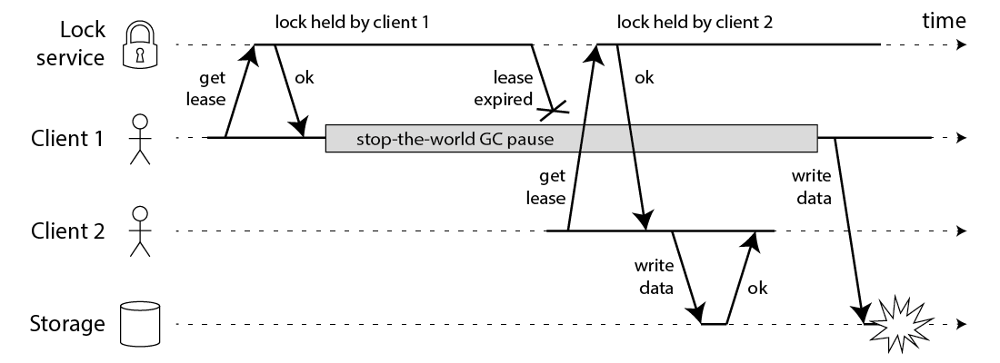
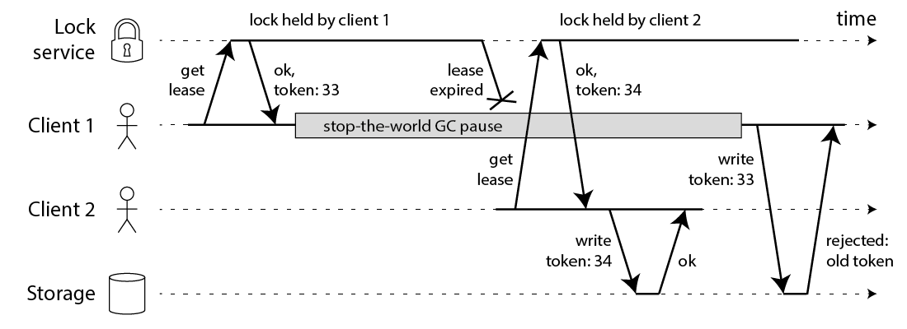
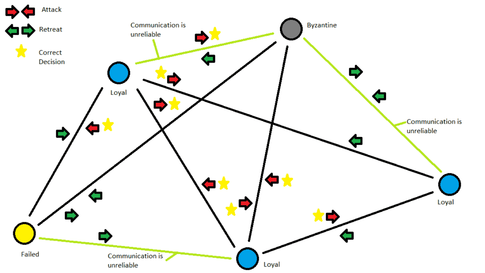

# The Trouble with Distributed Systems

Part 2

---

# Process pauses

<v-clicks>

- “stop-the-world” GC pauses have sometimes been known to last for several minutes
- a virtual machine can be suspended and resumed
- the user closes the lid of their laptop
- context-switches, hypervisor switches to a different virtual machine
- the CPU time spent in other virtual machines is known as _steal time_
- waiting for a slow disk I/O operation
- I/O pauses and GC pauses may even conspire to combine their delays
- swapping to disk (paging)
- SIGSTOP signal

</v-clicks>

---

**Can’t assume anything about timing, because arbitrary context switches and parallelism may occur.**

**Distributed system has no shared memory—only messages sent over an unreliable network**

---

# Response time guarantees

---

## Hard real-time systems (control aircraft, rockets, robots, cars, etc.)

There is a specified deadline by which the software must respond;
if it doesn’t meet the deadline, that may cause a failure of the entire system.

<v-click>
💸 Very expensive, and they are most commonly used in safety-critical embedded devices
</v-click>

---

# Limiting the impact of garbage collection

1. Treat GC pauses like brief planned outages of a node, and to let other nodes handle requests

2. Use the garbage collector only for short-lived objects and restart processes periodically

---

# Knowledge, Truth, and Lies

    

<v-click>

**⚠️ a node cannot necessarily trust its own judgment of a situation**

</v-click>
<v-click>

Rely on a quorum, that is, voting among the nodes

</v-click>

---

# The leader and the lock

<v-click>

**Fencing token:** a number that increases every time a lock is granted

</v-click>

---

# Byzantine Faults

> There is a risk that nodes may “lie” (send arbitrary faulty or corrupted responses)

The problem of reaching consensus in an untrusting environment is known as the Byzantine Generals Problem

---

## Byzantine fault-tolerant

A system is Byzantine fault-tolerant if it continues to operate correctly
even if some of the nodes are malfunctioning 
and not obeying the protocol, 
or if malicious attackers are interfering with the network.

<!--
- aerospace environments
- peer-to-peer networks like Bitcoin and other block‐
chains

- In most server-side data systems, the cost of deploying Byzantine fault-tolerant solutions makes them impracticable.

- input validation, sanitization, and output escaping are so important
-->

---

# Weak forms of lying

## Guard against

<v-clicks>

- invalid messages due to hardware issues
- software bugs
- misconfiguration

</v-clicks>

## Simple and pragmatic steps toward better reliability

<v-clicks>

- checksums in the application-level protocol
- some basic sanity-checking of values
- use of multiple NTP servers

</v-clicks>

---

# System Model and Reality

> formalize the kinds of faults that we expect to happen in a system

## Synchronous

- bounded network delay
- bounded process pauses
- bounded clock error

**Not realistic**

## Partially synchronous

- behaves like a synchronous system most of
  the time
- sometimes exceeds the bounds for network delay, process pauses, clock drift

**Realistic model of many system**

## Asynchronous

- not allowed to make any timing assumptions
- does not even have a clock
- cannot use timeouts

**Very restrictive**

---

## System models for node failures

### Crash-stop faults

- a node can fail in only one way, namely by crashing

### Crash-recovery faults

- nodes are assumed to have stable storage (i.e., nonvolatile disk storage) that is preserved across
  crashes
- the in-memory state is assumed to be lost

### Byzantine (arbitrary) faults

- Nodes may do absolutely anything, including trying to trick and deceive other nodes

---

# Safety and liveness

## Safety property

- we can point at a particular point in time at which it was broken
- violation cannot be undone

Always hold these properties and does not return wrong result

## Liveness property

- it may not hold at some point in time
- there is always hope that it may be satisfied in the future

Allow some caveats. e.g. eventual consistency

