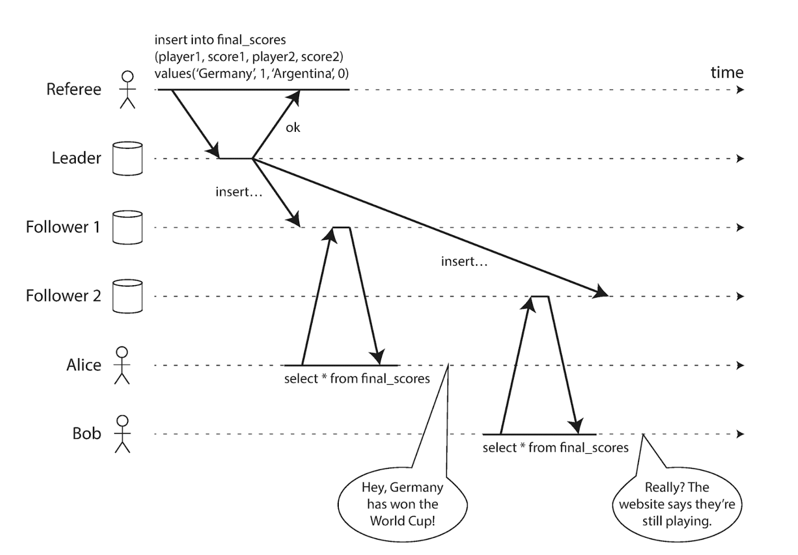
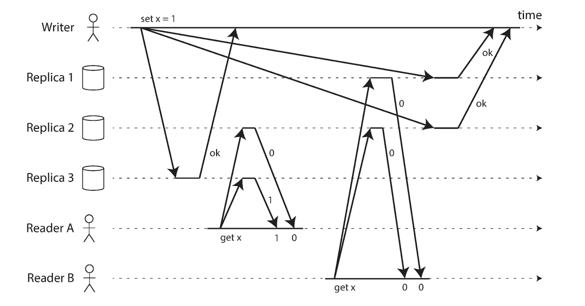

# Consistency and Consensus

---

# Summary of faults:

- Network faults: packet can be lost, reodered, duplicated or delayed
- Time faults: clocks are approximate, can skew, can be out of sync
- Process faults: node can pause or crash (garbage collection)

Goal: build abstractions that hide these faults and let programmers reason as if the system behaved normally (like transactions hide partial failures).

---

# Replication ⇒ inconsistency

Any replicated system introduces temporary disagreement:
- Updates reach replicas at different times
- Reads may see different versions
- Acknowledging a write does not mean all replicas applied it

---

# Eventual consistency

Guarantee: if no new updates occur, all replicas will eventually converge

Properties:
- Reads might return stale data
- No ordering guarantees across clients
- Read after write is not guaranteed
- Availability is prioritised

---

---

# Linearizability

Guarantee: The system behaves as if there is only one copy of the data, updated atomically in real time.

Properties:
- After a write completes, all subsequent reads see it
- Operations appear instantaneously applied at some point
- Ordering is preserved across clients
- Applies to single objects only

Important distinction:
- Linearizability: single object, real-time order
- Serializability: transactions across multiple objects

---

# When linearizability matters

Necessary for correctness when the latest state must be globally visible:
- Leader election (avoid split brain)
- Locks and coordination
- Uniqueness constraints (usernames, IDs)
- Financial balances
- Counters that must never go backward

Not necessary for:
- Caches
- Social feeds
- Analytics
- Final sports scores

---

# How to implement linearizable systems

Single system
- Single node holding all the data
- No replication, no fault tolerance

---

# How to implement linearizable systems

Replicated approaches
  - Single leader replication: potentially linearizabile if:
    - All the writes go through the leader
    - Reads are served from the leader or synchronously updated replicas
  - Multi leader replication: generally not linearizable
    - Concurrent writes on different leaders require conflict resolution
    - No global time ordering
  - Leaderless replication: usually not serializable
    - Writes go to multiple nodes independently
    - Conflict are resolved after the fact
    - Quorum reads/writes are not sufficient

---

# Quorum reads

Quorum is about having at least one updated node in your reads. But it's only after the write is completed.

Not guaranteed by quorum: all replicas are updated before reads.

---

# CAP Theorem

                         [ Consistency ]
                              /   \
                             /     \
                            /       \
     works perfectly       /         \   Always correct
     ultil partition      /           \  might refuse service
                         /             \
                        /               \
         [ Availability ]----------------[ Partition Tolerance ]
                          Continue to work
                        data might be stale

---

### Cap Theorem
You can't prevent network partitions

During the partition, if both sides accept writes:
- Availability stays high
- Consistency can diverge (AP)

If you block one side or reject requests:
- Consistency preserved (CP)
- Availability reduced

---

# Ordering

Correct behavior often depends on ordering.

Without ordering:
- Replies before requests
- Deletes before creates
- Inconsistent histories

Total order: All operation al globally ordered
- Every node agree on the same sequence
- Enables linearizability

Causal order (partial order): Effects are seen after their causes
- Concurrent independent operations may appear in different orders.
- Much cheaper to implement, but weaker guarantees
- Enables causal consistency (ie:messaging app)

---

# How to achieve causal consistency

Need to track "happened-before" relationship

Naive solutions:
- Physical clocks
- Separate counters per node
- Preallocated sequence ranges
All of these are better than sharing a single counter on a single leader, but have issues with causality

---

# Lamport timestamps

Each event has:
(timestamp, node_id)

Rules:

- Each node maintains a counter
- Increment on every event
- Include timestamp in messages
- On receive: counter = max(local, received) + 1

Tie-break using node ID.

Produces a total order, but
- total order != causal consistency, as we arbitrary pick what came first in case of conflicts
- cannot rely just on having a total order "eventually" for things like username clashes (clients needs a response)

---

# Total Order Broadcast

<v-clicks>

- A protocol for exchanging messages between nodes
- Requires two properties:
- **Reliable delivery**: no messages are lost; if a message is delivered to one node, it is delivered to all nodes (even if a node or the network is faulty)
- **Totally ordered delivery**: messages are delivered to every node in the same order

</v-clicks>

---

# Total Order Broadcast: where it shows up

<v-clicks>

- Consensus services (e.g., ZooKeeper)
- Database replication
- Serializable transactions
- Lock services with fencing tokens (see The leader and the lock)
- Linearizable storage (e.g., ensuring only one user can claim a unique username)

</v-clicks>

<!--
Fencing tokens = monotonically increasing numbers (e.g., sequence numbers or timestamps) issued by a lock service when a client acquires a lock
-->

---

# Distributed Transactions and Consensus

<v-clicks>

- **Consensus** is one of the most important and fundamental problems in distributed computing
- We often need multiple nodes to **agree** on something
- Common situations where consensus matters:
- Leader election
- Atomic commit (throwback: **atomicity** from Chapter 7)

</v-clicks>

---

# Atomic commit

<v-clicks>

- Goal: a transaction **either commits everywhere or aborts everywhere**
- On a single node, atomicity is usually implemented by the **storage engine**
- Once the transaction is written to the disk log (WAL), it has (practically) been committed

</v-clicks>

---

# Atomic commit in a multi-node system

<v-clicks>

- With multiple nodes, failures and network faults can split the outcome:
- Some nodes **commit** while others **abort**
- We need a protocol to ensure a single, consistent outcome
- **Two-Phase Commit (2PC)** is a classic protocol for atomic commit across nodes

</v-clicks>

---

# Two-Phase Commit (2PC)

<v-clicks>

- Two-phase commit (**2PC**) is an algorithm for achieving **atomic transaction commits across multiple nodes**
- It introduces a new component that does not appear in single-node transactions: the **coordinator**

</v-clicks>

<v-clicks>

**Coordinator:** usually implemented in a library within the application process, it's a component that handles the "source of truth" for transactions and instructs the multiple nodes on when to commit them.

</v-clicks>

---

# 2PC: process

- The application is ready to commit some data
- The coordinator sends a _prepare request_ to each node, asking them if they're able to commit the given transaction

## ✅ All nodes reply “yes”

- The coordinator decides to commit the transaction, and it writes the decision to disk (so that if it crashes, it can recover the decision)
- The coordinator sends a _commit request_ to the nodes
- The commit actually takes place

## ❌ At least one node replies “no”

- The coordinator decides to abort the transaction, and it writes the decision to disk (so that if it crashes, it can recover the decision)
- The coordinator sends an _abort request_ to the nodes
- The nodes abort the transaction

---

# The risks of 2PC

**⚠️ Blocking atomic commit protocol**

The main issue of 2PC is that the coordinator can be a single point of failure for the whole system.
That’s why it’s called a **blocking atomic commit protocol**: if the coordinator crashes after the nodes respond to a _prepare request_, the nodes can become stuck waiting for the coordinator’s decision.

---

# Distributed transactions in practice

<v-clicks>

- Two broad kinds of distributed transactions:
- **Database-internal distributed transactions**: span multiple nodes that use the same storage engine (e.g., a MySQL cluster)
- Usually simpler and can be better optimized, so they often work quite well
- **Heterogeneous distributed transactions**: span multiple storage engines, or even non-databases (message brokers, email servers, etc.)
- Much trickier to implement reliably

</v-clicks>

---

# XA transactions

<v-clicks>

- One approach for heterogeneous transactions is the **XA** standard
- XA is a C API (with bindings in many languages) for coordinating distributed transactions
- Powerful, but it comes with tradeoffs because the **coordinator** (running on the application server) starts to look like a database component:
- If it’s not replicated, it becomes a single point of failure (like we talked about above)
- You can’t easily run the application server in a fully serverless/stateless way, because the coordinator logs acts like a database
- More involved systems must agree before commit → more places for something to fail

</v-clicks>

<!--
🚨🚨🚨 Topic change after this slide 🚨🚨🚨
-->

---

# Fault-Tolerant Consensus

<v-clicks>

- The **consensus problem** is often formalized as: “One or more nodes may propose values, and the consensus algorithm decides on one of those values.”

</v-clicks>

<v-clicks>

## Consensus properties

</v-clicks>

<v-clicks>

1. **Uniform agreement:** no two nodes decide differently
2. **Integrity:** no node decides twice
3. **Validity:** if a node decides a value, that value must have been proposed by some node
4. **Termination:** every node that does not crash eventually decides some value

</v-clicks>

---

# What these properties mean in practice

<v-clicks>

- The first two capture the core idea: everyone decides the same outcome, and decisions are final
- **Termination** is the fault-tolerance part: if some nodes fail, the system can still make progress
- Typically: as long as a **majority** of nodes remain active, the algorithm can keep moving forward

</v-clicks>

---

# How consensus protocols avoid split-brain

<v-clicks>

- Most consensus protocols use:
- A **leader** (in some form)
- **Epoch numbers**
- Together they guarantee: **within each epoch, the leader is unique**
- If the current leader is suspected dead, nodes vote to elect a new leader
- Each election increments the epoch number
- If multiple nodes think they’re leader, the leader with the **higher epoch** wins

</v-clicks>

---

# Quorums and proposals

<v-clicks>

- A leader can’t just decide unilaterally
- It must propose a decision to other nodes
- It waits for a **quorum** to approve the proposal

</v-clicks>

<v-clicks>

A node will vote in favor of a proposal only if it is not aware of any other leader with a higher epoch number.

</v-clicks>

---

# Issues with consensus

<v-clicks>

- Consensus algorithms are a huge breakthrough for distributed systems, but they still have drawbacks
- They require a **strict majority (quorum)**
- That means you need **3 nodes to tolerate 1 failure**, **5 nodes to tolerate 2 failures**, and so on
- Most protocols also assume a **fixed set of nodes** (membership changes are possible, but add complexity)

</v-clicks>

---

# Issues with consensus (cont.)

<v-clicks>

- They rely on **timeouts** to detect failed nodes
- In geographically distributed systems, temporary network issues can cause **false failure detection**
- Nodes may incorrectly believe the leader has failed → trigger leader elections
- This can seriously hurt performance: the system may spend more time **choosing a leader** than doing useful work
- Some algorithms can even get into election loops under specific timing conditions

</v-clicks>

---

<video class="w-100 rounded-lg mx-auto my-auto" autoplay muted loop playsinline>
  <source src="../assets/chapter09/end.mp4" type="video/mp4" />
  Your browser does not support the video tag.
</video>
