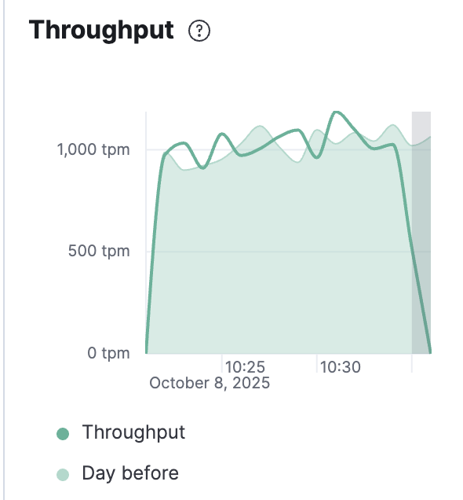
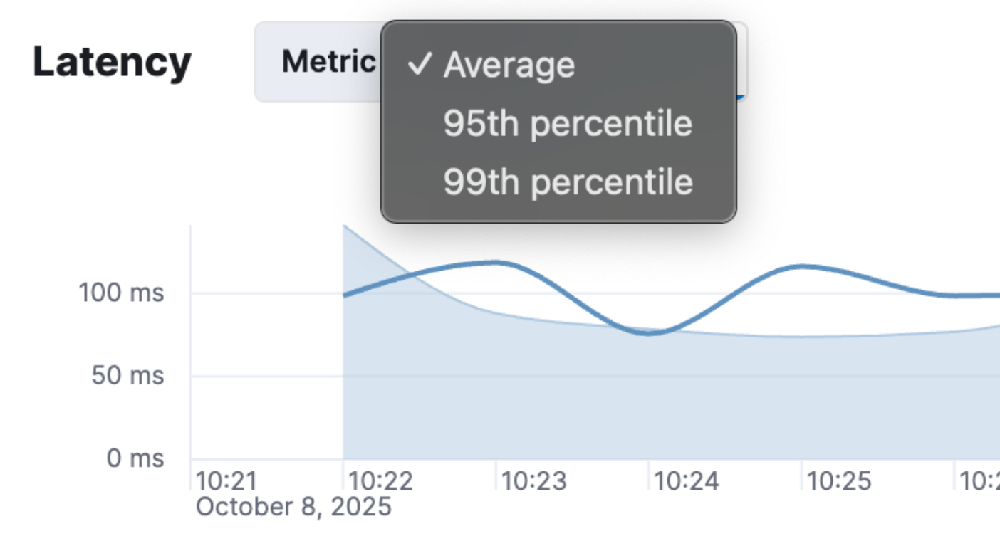

# DDIA study group

Chapter 1

---

# What this book will help with

- It helps design scalable, reliable, and maintainable software architectures.

- It clarifies trade-offs among consistency, availability, and performance.

- It provides a framework for evaluating technologies.

Systems design is about tradeoffs. This book might help you figure out what are the core elements to consider in a design of a system.

<!--
why data intensive? as most applications today are limited by the complexity, amount and speed of change of data rather than CPU
-->

---

# Core terminology

We usually build complex systems by connecting smaller components (database, queues, caches, etc) into a bigger system. This poses a lot of questions, like how to keep the data consistent during failure, how to have good performance when parts of the systems are degraded.. etc.

We can summarise those concerns in three main categories:

- Reliability: The system works correctly even in the face of adversity (hw/sw failure, human error)
- Scalability: As the system grows in volume, traffic or complexity, there are reasonable way to deal with that grow
- Maintainability: Over time more people will work on the system, and the should be able to be productive

---

# Reliability

Key difference, fault vs failure

- Faults: things that can go wrong (ie: off the specs of the system)
- Failure: when the system stops providing the require service to the user

The goal is to ensure that faults don't create failures. It's impossible to reduce the number of faults to zero, so it's better to design a system that is fault-tolerant, and the best way is to increase the number of faults (see netflix chaos monkey)

Reliability is critical not only for nuclear power stations: outages cause lost productivity, encour in legal risks, or have huge costs in lost revenue. We might choose a tradeoff to sacrifice reliability for development cost, but it should be a conscious decision.

---

# Faults

- Hardware faults: Disk failure, faulty RAM, blackouts. More hardware provides more redundancy, but also statistically more chances for breakage. Also unavailability of VMs instances are known to fail, so systems should be fault-tolerant towards a single machine failure.
- Software faults: Might have more impact, as usually hardware is solved by redundancy, but software bug can spans across all the instances.Many mitigations, but the idea is for the system itself to check if a discrepacy is found
- Human errors: Ie: misconfiguration errors by operators is a major cause of outages. Mitigation: design system that minimise oppotunities for errors. Provide sandbox for experiments. Slow rollouts so failures affect less users. Good telemetry (monitoring of performances of errors)

---

# Scalability

A system's ability to cope with increased load.

it's not a boolean flag for a system that can be either scalable or not scalable, but more answering questions like "if the system grows in this specific way, how do we deal with the additional load". Also an architecture that can cope with a specific level of load, rarely will cope with 10x that load. An architecture should be build around which operations will be common and which ones will be rare.

Load parameters can be very different from system to system: maybe it's simple RPS to a web server, % of cache hits or else, depending on what matters for the system.

Example of twitter load: how designing a system differently might have different impact on where the load is.

Terminology:

- Scaling up (vertical scaling): move to a more powerful machine
- Scaling out (horizontal scaling): distribute the load to more machines - but services should be stateless.

<!--
Twitter example: when loading the home page of an user, join all the subs and all the posts vs when creating a new tweet directly write in the cache of user homepages that are following that user. Huge shift between read skewed vs write skewed, hybrid approach might be the best here based on number of followers
-->

---

# Common performance numbers

- Throughput: rate a system can process request/data
- Latency: how long a request is "latent" before is served from the service
- Response time: time between client sending a request and receiving a response

  
  

To evaluate response time, it is common to use percentiles: common are p50, p95, p99, p999. That means that x% of the requests are faster than the treshold. It might be that a system is slower for users that have a lot of data (so the most valuable customers), or might be that services are doing multiple calls to services, so there is an amplification effect of response time, so they can't be ignored.

---

# Maintanability

The majority of cost of a software is not the initial development, but its ongoing maintenance. To avoid creating "legacy" software, there are some principles to follow:

- Operability: Should be easy for ops teams to keep the system running smoothly (that's mostly ourselves)
- Simplicity: New engineers should understand the system easily, complexity is removed
- Evolvability: Engineers can change the system easily even for unanticipated use cases. Strictly tied to the simplicity of a system.

---

# Reflection time

- How do we balance reliability, scalability, and maintainability in our systems, and which one tends to dominate our design decisions?

- What kinds of faults (hardware, software, human) are most common in our environment, and how can we make our systems more fault-tolerant to them?

- How would our architecture behave if that load suddenly increased 10×?

- What makes our systems easy or hard to evolve over time, and how could we design for better maintainability from the start?
