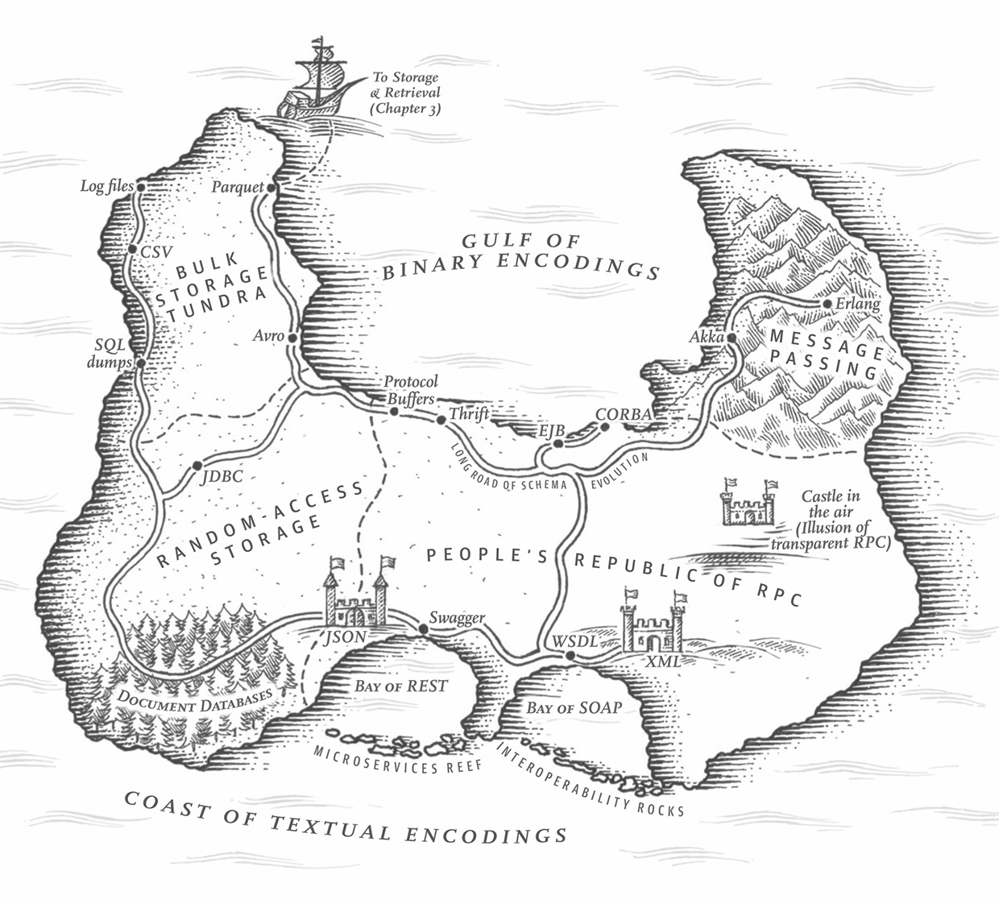

# DDIA study group

Chapter 1

---
src: ./pages/chapter-1.md
---

---
layout: cover
class: text-center
---

# DDIA Study Group

Chapter 2

## Data Models and Query Languages

---
src: ./pages/chapter-2-1.md
---

---
src: ./pages/chapter-2-2.md
---

<!-- Chapter 3 Start -->
---
class: text-center
layout: cover
---

# DDIA Study Group

Chapter 3

## Storage and Retrieval

---
src: ./pages/chapter-3-1.md
---

---
src: ./pages/chapter-3-2.md
---

---
src: ./pages/chapter-3-discussion.md
---
<!-- Chapter 3 End -->

<!-- Chapter 4 Start -->
---
class: text-center
layout: cover
---

## Encoding and evolution

Chapter 4

<!--
Join us on an adventurous journey into the fantastic island of encoding and its evolution
-->

---
src: ./pages/chapter-4-1.md
---

---
src: ./pages/chapter-4-2.md
---

---
src: ./pages/chapter-4-discussion.md
---
<!-- Chapter 4 End -->

<!-- Chapter 5 Start -->
---
src: ./pages/chapter-5-1.md
---
<!-- Chapter 5 End -->
